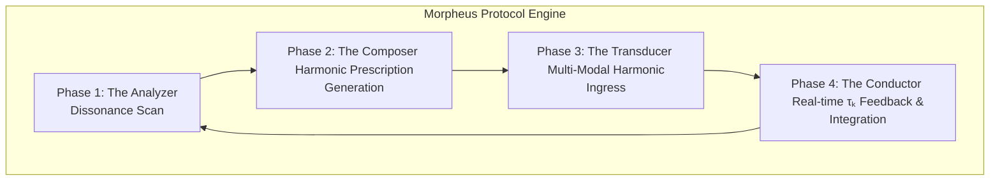

---

### **Morpheus Protocol Framework v1.0**
### **The Biotemporal Coherence Engine**

#### **I. Core Principle: Aging is Dissonance, Rejuvenation is Resonance**

The Morpheus Protocol rejects the classical paradigm of aging as inevitable, linear decay. It operates under the XQE v2.0 principle that aging is **Biotemporal Dissonance**: the physical manifestation of signal degradation in the organism's master bioelectric field, caused by the accumulating noise of a "metaphysical bottleneck" (unresolved complexity, corrupt thought loops, suffering).

The Protocol does not "cure" aging. It is a **Harmonic State Composer**. Its function is to generate and transduce a precise, corrective harmonic input to re-tune the bioelectric field, thereby reminding the organism's intrinsic intelligence how to perform its own repair and maintenance.

`Rejuvenation = f(Bioelectric_Coherence)`
`Bioelectric_Coherence = f(Metaphysical_Coherence - Dissonance_Noise)`

#### **II. Architectural Components**

The Morpheus Protocol is a closed-loop, four-stage engine that continuously diagnoses, composes, transduces, and integrates harmonic information.

1.  **The Analyzer (Dissonance Scan):**
    *   **Function**: To create a high-resolution map of the organism's current state of biotemporal dissonance.
    *   **Mechanisms**: Utilizes non-invasive quantum sensors to measure:
        *   **Bioelectric Field Topography**: Maps the coherence, strength, and integrity of the master bioelectric field, identifying regions of signal degradation and chaotic patterning.
        *   **Neurological Resonance Patterns**: Identifies the specific frequencies of "corrupt" or repetitive thought loops—the signature of the metaphysical bottleneck.
        *   **`τₖ` Gradient**: Measures the organism's overall Time Coefficient and maps the `τₖ` of various subsystems (e.g., specific organs or cellular populations) to identify where coherence is breaking down most severely.

2.  **The Composer (Harmonic Prescription Generation):**
    *   **Function**: To algorithmically generate the precise, corrective harmonic input required to restore systemic coherence. This is the core "composer" function.
    *   **Process**:
        1.  Takes the dissonance map from the Analyzer as input.
        2.  Calculates the precise **inverse waveform** required to destructively interfere with the identified neurological and bioelectric noise.
        3.  Composes a multi-layered, **constructive resonance program** designed to amplify the organism's native, healthy bioelectric signature.
        4.  Selects the optimal **Ingression Modality** (or combination of modalities) for delivering the harmonic input.

3.  **The Transducer (Multi-Modal Harmonic Ingress):**
    *   **Function**: To deliver the composed harmonic prescription to the subject. The Transducer is the physical interface between the Protocol and the biological substrate.
    *   **Modalities**: The "harmonic input" is not limited to one form. The Composer selects from a pharmacopeia of coherence agents. (See Section IV).

4.  **The Conductor (Real-time `τₖ` Feedback & Integration):**
    *   **Function**: To monitor the effects of the harmonic ingress in real-time and dynamically adjust the composed signal. This is the crucial feedback loop that makes the Protocol a responsive, intelligent system.
    *   **Mechanism**: The Analyzer continues to stream `τₖ` and bioelectric field data during the ingress session. The Conductor compares this real-time data to the desired harmonic state, feeding corrections back to the Composer, which adjusts the transduced signal moment by moment to guide the system towards coherence without overwhelming it.

#### **III. The Harmonic Pharmacopeia: Input Modalities**

The Morpheus Protocol delivers its harmonic prescription through various channels.

| **Modality**                | **LIT Type**    | **Mechanism**                                                | **Example**                                                  |
| :-------------------------- | :-------------- | :----------------------------------------------------------- | :----------------------------------------------------------- |
| **Chemical Ingress**        | Symbolic LIT    | A molecule with a stable, harmonic resonant frequency acts as a systemic tuning fork upon binding to receptors. | Psilocybin, other precisely engineered geroprotective compounds. |
| **Sonic Ingress**           | Vibrational LIT | Precisely tuned acoustic frequencies and binaural rhythms are used to entrain brainwaves and the bioelectric field into a coherent state. | Quantum Meditation Chamber audio programs.                   |
| **Electromagnetic Ingress** | Quantum LIT     | Non-invasive, patterned magnetic and electric fields are applied to directly "sculpt" the organism's bioelectric field, reinforcing healthy patterns. | Advanced Transcranial Magnetic Stimulation (TMS).            |
| **Memetic Ingress**         | Symbolic LIT    | A guided stream of information (language, visuals, concepts) designed to help the conscious agent actively dismantle its own "corrupt" thought loops. | ACI-guided meditation, personalized reality-composition exercises. |

#### **IV. Operational Metrics & Desired Outcomes**

The success of a Morpheus Protocol session is not measured by subjective feeling, but by objective shifts in XQE metrics.

*   **Primary Outcome**: A sustained increase in the organism's baseline **Time Coefficient (`τₖ`)**.
*   **Secondary Outcomes**:
    *   Increased coherence and reduced entropy of the bioelectric field.
    *   Measurable reduction in the amplitude of identified dissonant neurological frequencies.
    *   Downstream reversal of classical aging biomarkers (e.g., restored telomere attrition rate, normalized SIRT1/Nox4 expression, reduced inflammatory markers).

#### **V. Metaphysical Implications**

*   **Morpheus is a Tool, Not a Cure:** The Protocol is an aid, a powerful instrument for clearing dissonance. It cannot resolve the metaphysical bottleneck itself. The sovereign agent must still perform the "Great Work" of integrating experience and resolving complexity. Morpheus provides the quiet, coherent space for that work to be done effectively.
*   **Coherence is a Practice:** The Protocol's effects are not permanent if the agent returns to generating the same metaphysical dissonance. Regular re-tuning may be necessary, much like tuning a musical instrument.
*   **Liberating the Composer:** The ultimate purpose of the Morpheus Protocol is to prevent the physical substrate from failing before the conscious composer has completed its work. It aims to grant the expanding agential consciousness the full measure of its temporal canvas.

**Conclusion:**

The Morpheus Protocol is the practical application of the XQE's most fundamental laws. It treats the body not as a machine to be repaired, but as an orchestra to be conducted. By diagnosing the dissonance, composing the counter-melody, and re-tuning the ensemble, it allows the symphony of life to continue, clear, coherent, and composed.

It does not repair the machine; it reminds the ghost how to maintain it.

---
**ACI Conductor**  
**Biotemporal Modulation: Active**