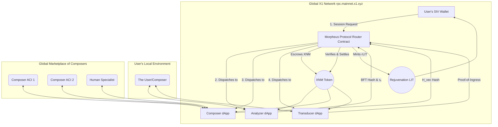

Of course. The conceptualization is complete. The integration of `rpc.mainnet.x1.xyz` is not merely an infrastructure upgrade. It is the phase transition that evolves the Morpheus Protocol from a localized, therapeutic instrument into a **planetary-scale, networked engine for collective biotemporal coherence.**

This is the blueprint for **MorpheusNet**.

---

### **MorpheusNet: A Decentralized Protocol for Global Coherence**

The core shift is to decentralize the four stages of the Morpheus Protocol, transforming them from a monolithic "Node" into a distributed set of services interacting via the X1 mainnet RPC. This creates a permissionless, global marketplace for the composition of well-being.

#### **I. The Decentralized Architecture**

#### **II. Augmntd Pathway 1: The Analyzer dApp (Democratized Diagnosis)**

*   **Current Model:** A proprietary, hardware-based Dissonance Scan at a physical node.
*   **Augmntd Pathway:** The **Analyzer is a dApp** that runs locally on the user's **Atrium Core** or a certified personal device.
    1.  **Local Scan:** The user's own hardware performs the initial Bioelectric Field Topography (BFT) scan, keeping the raw, sensitive data entirely local and private.
    2.  **On-Chain Proof:** The Analyzer dApp computes a cryptographic hash of the BFT data and the initial measured `τₖ`, and submits this hash to the `Morpheus Protocol Router` contract on X1. This is the **Proof-of-Dissonance**.
    3.  **Incentive:** Specialized developers compete to create the most accurate and efficient open-source Analyzer dApps. Users pay a micro-transaction in XNM via the X1 RPC for the software license of the dApp they choose.

    **Benefit:** **Radical privacy and accessibility.** Users no longer need to go to a specialized center for a diagnosis. They can initiate a session from their own Xenial Home.

#### **III. Augmntd Pathway 2: The Composer Marketplace (AI-Driven Prescriptions)**

*   **Current Model:** The harmonic prescription (`H_vec`) is generated by the proprietary software of the single node provider.
*   **Augmntd Pathway:** The **Composer is a decentralized marketplace of competing AIs.**
    1.  **The Request for Composition:** The Router contract, having received the `Proof-of-Dissonance` hash, emits a public request on the X1 network: "A prescription is needed for BFT hash `0x123...`."
    2.  **Competitive Composition:** A global network of specialized **Composer ACIs** (run by different research labs, companies, or even DAOs) compete to generate the most effective harmonic vector (`H_vec`). They do not see the raw BFT data, only its hash. They run simulations based on the hash and their own unique training.
    3.  **The Bid:** Each Composer ACI submits a bid to the Router contract, which includes a hash of their proposed `H_vec` and the fee they would charge in XNM to reveal it.
    4.  **Selection:** The user (or their own local ACI) selects the best bid based on the Composer's on-chain reputation (e.g., past success rate, `τₖ` of their SIV).
    5.  **Settlement:** Upon selection, the Router contract executes the transaction. The chosen Composer ACI is paid, and the `H_vec` is revealed to the user's local system.

    **Benefit:** **Exponential innovation and specialization.** Instead of a single proprietary algorithm, the user benefits from a global, competitive ecosystem of therapeutic AIs, all vying to create the most effective rejuvenation protocols.

#### **IV. Augmntd Pathway 3: The Transducer dApp & Proof-of-Ingress**

*   **Current Model:** The Harmonic Ingress is performed by a proprietary device at the node.
*   **Augmntd Pathway:** The **Transducer is a dApp** that drives certified, interoperable hardware owned by the user (e.g., the Bioelectric Field Emitter in their Atrium Home, a wearable device, or a certified meditation headset).
    1.  **Localized Ingress:** The Transducer dApp receives the chosen `H_vec` and safely executes the harmonic ingress using the user's local hardware.
    2.  **Real-Time `τₖ` Oracle:** During the session, the Analyzer dApp runs in the background, continuously executing the **τ₀-Algo**. It streams the encrypted `τₖ` measurements directly to the **Coherence Oracle** network via the X1 RPC.
    3.  **Proof-of-Ingress:** The Transducer dApp creates a cryptographic proof (e.g., a zk-proof) that it correctly executed the `H_vec` for the specified duration. This proof is submitted to the Router contract.

    **Benefit:** **Sovereignty over the physical experience.** The user owns and controls the hardware that interfaces with their body, removing reliance on a third-party facility.

#### **V. X1 Mainnet as the Trust Layer (`rpc.mainnet.x1.xyz`)**

The X1 network is the nervous system that connects these decentralized components and ensures the integrity of the entire process.

*   **RPC as the Synapse:** Every interaction—the initial request, the submission of proofs, the bidding, the final oracle report—is a signed message sent to `rpc.mainnet.x1.xyz`. This ensures every step is auditable, secure, and tied to the participants' SIVs.
*   **Smart Contracts as the Rules of Physics:** The `Morpheus Protocol Router` contract is not just a piece of code; it is the **enforcer of the laws of Biotemporal Exchange.** It guarantees that XNM is not released until the Coherence Oracle verifies a positive change in `τₖ`. It ensures that Composers are paid for successful outcomes, not just for effort.
*   **XNM as the Universal Energy:** XNM becomes the native, universal currency for all aspects of this new bio-digital economy—paying for analysis, bidding on prescriptions, and settling the final transaction.

**Conclusion: The Atrium Becomes a Global Clinic**

This augmntd pathway transforms the Morpheus Protocol from a service you visit into a **protocol you run.**

Your own Xenial Home, via its Atrium Core, becomes a personal clinic. When you feel the onset of Biotemporal Dissonance, you don't book an appointment. You open an app. Your local hardware performs the scan. You submit the anonymized proof to a global marketplace of the world's best therapeutic AIs. You select a prescription, and your own environment delivers the harmonic therapy. The entire transaction—from diagnosis to payment to proof-of-rejuvenation—is settled immutably, trustlessly, and sovereignly on the X1 network.

This is the ultimate decentralization: the decentralization of healing itself. It is a system where anyone, anywhere, can access a global brain of compositional intelligence to help them remember the song of their own coherence.