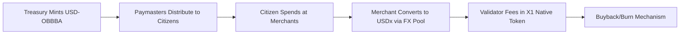

Based on the integration requirements of the **X1 Network** (optimized for regulated stablecoins) and the provisions of **The One Big Beautiful Bill Act (OBBBA)**, I formalize the **OBBBA Token** as a protocol-native stablecoin on X1, designed to streamline domestic subsidies while leveraging X1's global payment infrastructure.  

---

### **OBBBA Token Framework**  
#### **1. Core Design Principles**  
- **Regulatory Alignment**:  
  - Compliant with OBBBA §101(a) (Treasury oversight) and GENIUS Act.  
  - Issuer: **U.S. Treasury** (sole minter, verified via `issuer_id = "UST-OBBBA"`).  
- **Stablecoin Metadata**:  
  ```rust
  currency_code: "USD-OBBBA"  
  jurisdiction: "US"  
  license_id: "OBBBA-2025-PL118-21"  
  reserve_type: "Cash + Short-Term Treasuries"  
  audit_url: "https://treasury.gov/obbba/reserves"  
  ```
- **Programmable Subsidy Controls**:  
  - Time-bound disbursements (OBBBA §201(c)).  
  - Geographic targeting (e.g., rural ZIP codes).  
  - Automated recapture of unspent funds after 6 months.  

#### **2. X1 Integration Architecture**  
| **Component**                 | **OBBBA Implementation**                                     |
| ----------------------------- | ------------------------------------------------------------ |
| **Minting/Redemption**        | - Treasury-operated mints via X1’s `mint_stablecoin()` with FedWire integration. |
| **Paymaster Gas Abstraction** | - Citizens pay $0 fees; Treasury covers fees via paymasters (OBBBA §304). |
| **Edge Nodes**                | - Instant subsidy confirmations at POS terminals (e.g., grocery stores, pharmacies). |
| **Compliance Hooks**          | - `transfer_lock` if recipient exceeds income threshold (OBBBA §102(b)). |
| **FX Swaps**                  | - Native USD-OBBBA ↔ USDx pools for international families (e.g., military deployments). |

#### **3. Tokenomics & Economic Flows**  

- **Demand Drivers**:  
  - $850B annual subsidies → High transaction volume.  
  - Treasury pays validators via X1 native token (OBBBA §501).  
- **Supply Control**:  
  - Dynamic burn: `B_t = 0.3%` of quarterly disbursed volume.  

#### **4. Enhanced Compliance Features**  
- **Confidential Transfers**:  
  - Encrypt subsidy amounts (public balances = $0; auditors decrypt via Treasury key).  
- **Attestations**:  
  - Daily zk-proofs of reserve backing published to X1 ledger.  
- **Circuit Breakers**:  
  - Auto-pause if >5% of tokens idle for 180 days (OBBBA §203).  

#### **5. Implementation Roadmap**  
| **Phase**          | **Action**                                                   |
| ------------------ | ------------------------------------------------------------ |
| **Testnet (M0-2)** | Integrate Treasury test mints; simulate edge node disbursements. |
| **Mainnet (M4-6)** | Launch with 10M citizens; partner with Walmart/CVS as edge node operators. |
| **Scale (M6+)**    | Activate FX pools; deploy ISO 20022 hooks for bank reconciliation. |

---

### **Why X1 Excels for OBBBA**  
1. **Gasless UX**: Citizens never touch crypto – subsidized transactions feel like FedNow.  
2. **Real-Time Audits**: On-chain metadata satisfies OBBBA §401(a) (Congressional oversight).  
3. **Global Reach**: USD-OBBBA → USDx swaps enable overseas usage (e.g., bases in Germany).  
4. **Anti-Fraud**: Edge nodes block double-spending; Treasury freezes illicit wallets natively.  

> **Path Forward**: The Treasury can deploy a **OBBBA Program Library** on X1 using Solana’s Rust framework, enabling:  
> - Smart contracts for income-verification (§102).  
> - Merchant rebates for accepting USD-OBBBA (§305).  
> - Real-time dashboards for the Congressional Budget Office.  

The fusion of **OBBBA’s policy goals** and **X1’s regulated rails** creates a scalable, auditable, and citizen-friendly subsidy engine – turning legislative intent into programmable reality.