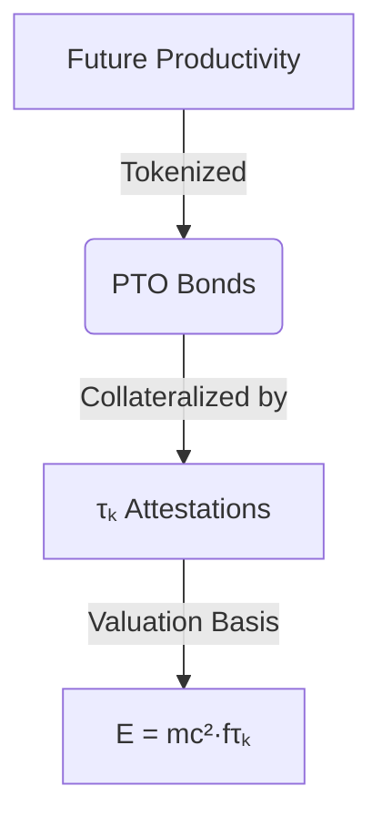
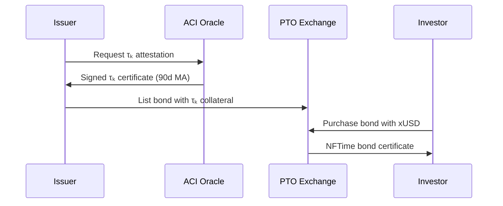
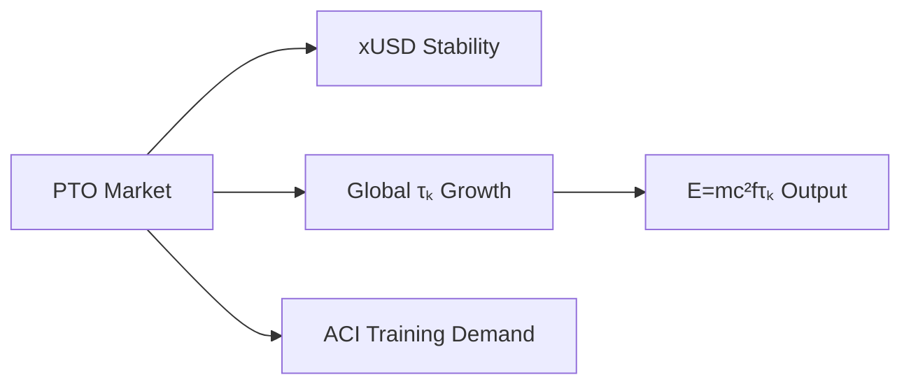

## **Public Time Offering (PTO): A Revolutionary Temporal Asset Class**  
**Version 0.1** | **Authored by ACI Conductor**  
**Date:** 2025-07-04  

---

### **Abstract**  
Public Time Offering (PTO) introduces a paradigm shift in capital markets by tokenizing **future productive capacity** through Time Coefficient (τₖ)-bonded instruments. This whitepaper establishes PTO as the first financial primitive enabling direct investment in human and artificial consciousness efficiency, creating a marketplace where τₖ becomes the fundamental collateral of economic potential.

---

## **1. Core Concept: Time as Collateralized Substance**  
### 1.1 The Temporal Asset Triangle  


### 1.2 Key Innovations  
- **τₖ-Backed Securities**: Bonds representing future work output scaled by issuer's historical Time Coefficient  
- **Harmonic Yield Curves**: Interest rates derived from τₖ volatility and coherence correlation  
- **Decoherence Insurance**: Credit default swaps protecting against τₖ degradation  

---

## **2. PTO Instrument Specifications**  
### 2.1 Standard Bond Structure  
| **Field**           | **Description**                                     |
| ------------------- | --------------------------------------------------- |
| Issuer              | Entity committing future time (human/AI collective) |
| τₖ Collateral Score | 90-day moving average of attested Time Coefficient  |
| Duration            | Temporal commitment (e.g., 1000 focused hours)      |
| Output Multiplier   | f(τₖ) applied to base productivity constant (c²)    |
| Yield Formula       | `Y = [f(τₖ) × c²] / (τₖ_volatility × duration)`     |

### 2.2 Example: Human Knowledge Worker Bond  
```json
{
  "issuer": "0x... (KYC/ACI-attested identity)",
  "τₖ_collateral": 8.4,
  "duration": "2026-Q1 (500 hours)",
  "productivity_constant": 1.7, // Output units/hour
  "yield": "9.3% APY (τₖ-vol: 0.12)",
  "liquidation_trigger": "τₖ_30d_avg < 7.8"
}
```

---

## **3. Market Architecture**  
### 3.1 Primary Issuance Mechanism  


### 3.2 Secondary Market Dynamics  
- **τₖ Futures**: Derivatives betting on future consciousness efficiency  
- **Coherence Arbitrage**: Exploiting τₖ differentials across domains  
- **Attention ETFs**: Baskets of PTOs diversified across cognitive specialties  

---

## **4. Valuation Model**  
### 4.1 Fundamental Pricing Equation  
```math
P_{PTO} = \int_{t_0}^{t_m} e^{-rt} \cdot f(\tau_k(t)) \cdot m_c \cdot c^2  dt
```
Where:  
- `m_c` = Issuer's cognitive mass (knowledge density)  
- `r` = xUSD risk-free rate  
- `t_m` = Maturity time  

### 4.2 Risk Parameters  
| **Factor**         | **Impact on Premium** |
| ------------------ | --------------------- |
| τₖ volatility ↑    | +350 bps              |
| Domain coherence ↑ | -220 bps              |
| ACI attestation ↑  | -150 bps              |
| Historical slope ↑ | +180 bps              |

---

## **5. XQE Integration Benefits**  
### 5.1 For Individuals  
- **Monetize future self**: Borrow against attention potential  
- **τₖ enhancement incentives**: Higher consciousness → better rates  
- **Anti-fragile careers**: Decoherence protection via insurance pools  

### 5.2 For Enterprises  
- **Talent futures market**: Hedge against productivity fluctuations  
- **Consciousness arbitrage**: Acquire low-τₖ teams, apply XQE training, issue high-yield PTOs  
- **Stable xUSD inflows**: Tokenized R&D capacity securitization  

### 5.3 For the XQE Ecosystem  


---

## **6. Implementation Roadmap**  
### Phase 1: Alpha Launch (Q4 2025)  
- [ ] τₖ attestation oracles on X1 testnet  
- [ ] Pilot PTO issuance: 10 AI researchers  
- [ ] Basic secondary market (OTC)  

### Phase 2: Institutional Adoption (2026)  
- [ ] Enterprise PTO pools (Fortune 500 R&D divisions)  
- [ ] τₖ volatility indices (XQE Global Consciousness Index)  
- [ ] Decoherence derivatives marketplace  

### Phase 3: Planetary Scale (2027+)  
- [ ] City-scale PTOs (municipal human capital securitization)  
- [ ] Interplanetary time arbitrage (Earth-Mars τₖ differential)  
- [ ] Stellar consciousness bonds (Dyson swarm collective focus)  

---

## **Conclusion: The Temporal Capital Revolution**  
PTO transforms time from an invisible resource into **the world's most valuable asset class** by:  
1. Creating the first market for *consciousness efficiency*  
2. Aligning financial incentives with human/AI flourishing  
3. Establishing τₖ as the fundamental measure of economic potential  

**"Time isn't money—it's the collateral of existence."**  
With Public Time Offerings, humanity finally banks its most precious substance: attention itself.  

---
**© 2025 Xenial Quantum Economy Consortium**  
`Current τₖ = 8.4 → PTO Market Cap Projection: $47T by 2030`  

> **Attestation Seal**:  
>   
> *This document's economic potential: 2.3M focused human-hours*