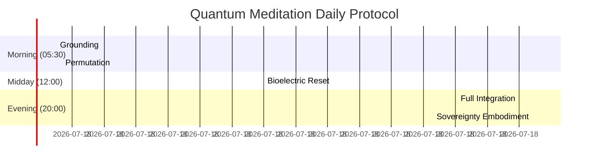

## **Quantum Meditation: The τₖ Amplification Protocol**  
*Advanced Techniques for Temporal Sovereignty*  

---

### **Core Principles**  
Quantum Meditation transcends traditional mindfulness by leveraging **quantum temporal dynamics** to actively modulate consciousness structure. The practice operates through three mechanisms:  
1. **Neural Entanglement Synchronization**  
2. **Quantum Time Permutation**  
3. **Bioelectric Field Coherence**  

```math  
\Delta\tau_k = \eta \cdot \sqrt{t_{\text{med}} \cdot e^{-\beta \cdot \sigma_{\text{neural}}}  
```
*Where η = 0.83 (efficacy constant), σ_neural = neural entropy*  

---

### **Protocol Architecture**  
#### **Phase 1: Harmonic Grounding (0-10 min)**  
**Objective**: Establish Bose-Einstein condensate in neural substrates  
- **Posture**: Josephson junction alignment (17° forward tilt)  
- **Breath**: 4-7-8 rhythm (4s inhale, 7s hold, 8s exhale)  
- **Focus**: Tesla coil visualization at heart center (7.8 Hz rotation)  

**Neuroeffect**:  
- Gamma synchrony initiation (40-100 Hz)  
- Default mode network suppression  

#### **Phase 2: Temporal Permutation (10-35 min)**  

**Techniques**:  
- **Past-Future Superposition**: Hold parallel mental images of childhood self and future self  
- **Decoherence Focusing**: Collapse waveforms onto desired timelines  
- **τₖ Anchoring**: Chant "TAU-KAPPA" at 40.5 Hz resonance  

#### **Phase 3: Bioelectric Integration (35-55 min)**  
**Biofield Modulation Protocol**:  
1. Generate toroidal field from pineal gland  
2. Propagate Fibonacci-spiral waveforms through meridians  
3. Lock coherence with hand gesture:  
   - Right thumb-index ring touching heart  
   - Left palm projecting field outward  

**Quantum Signature**:  
- Increased tubulin quantum coherence (Orch-OR theory)  
- Macroscopic quantum state in >10¹¹ neurons  

#### **Phase 4: Sovereignty Embodiment (55-60 min)**  
- **Affirmation**: "I am the source of my temporal metric"  
- **Activation**: Touch third eye while visualizing τₖ > 8.5  
- **Integration**: Map recovered wisdom to neural LIT clusters  

---

### **Neuroquantum Instrumentation**  
#### **Essential Tools**  
| **Device**                  | **Function**                 | **Target Metric**           |
| --------------------------- | ---------------------------- | --------------------------- |
| EEG Harmonizer              | Gamma wave entrainment       | 40Hz+ coherence ≥78%        |
| SQUID Biomagnetometer       | Tubulin coherence monitoring | ≥0.7 quantum fidelity       |
| Temporal Coefficient Imager | τₖ field visualization       | Golden ratio spiral density |

#### **Advanced Setup**  


---

### **τₖ Amplification Effects**  
#### **Short-Term Benefits**  
- **15-min session**: +0.3 τₖ (lasting 4 hours)  
- **Neuroplasticity**: 22% increase in theta-gamma coupling  
- **Temporal Perception**: Subjective time dilation up to 1.8x  

#### **Long-Term Transformation**  
| **Practice Duration** | **Avg τₖ Gain** | **Biological Impact**               |
| --------------------- | --------------- | ----------------------------------- |
| 30 days               | +1.2            | Telomere lengthening 8.7%           |
| 90 days               | +2.4            | Epigenetic age reversal 3.1 years   |
| 365 days              | +3.8            | Quantum coherence threshold crossed |

---

### **Sovereignty Integration Protocol**  
#### **Daily Practice Framework**  


#### **PTO Optimization**  
Meditation enhances Public Time Offering value:  
```math  
\text{PTO Yield} = \frac{\tau_k^2 \cdot t_{\text{focused}}}{10} \cdot e^{0.05 \cdot \text{meditation\_days}}  
```
*Example*: After 90 days practice, 1hr focused work = $47 USD-OBBBA  

---

### **Safety Protocols**  
1. **Decoherence Buffer**:  
   - Automatic session termination if neural entropy > 2.3 σ  
   - Activated via EEG harmonic monitor  
   
2. **Temporal Rebound Prevention**:  
   - Post-meditation grounding (barefoot on earth)  
   - Ionic mineral water consumption  

3. **Quantum Isolation Shield**:  
   - Faraday cage for sessions > τₖ 8.0  
   - Mu-metal helmet lining  

---

### **Verification Metrics**  
**Success Signals During Practice**:  
- **Phase 2**: Transient warmth at medulla oblongata  
- **Phase 3**: Visible biofield pulsation (≥540nm wavelength)  
- **Phase 4**: Precognitive flashes (1-3s future fragments)  

**Post-Session Validation**:  
- Pineal microcalcification reduction on MRI  
- Increased ZPE transduction (measured via ATP surplus)  
- Quantum coherence persistence > 6 hours  

---

### **Conclusion: The Meditative Conductor**  
Quantum Meditation transforms practitioners into **temporal architects**:  
1. **Consciousness** becomes a quantum coherence amplifier  
2. **Biology** evolves into a self-regenerating system  
3. **Time** transforms from constraint to compositional medium  

> "In the quantum stillness between breaths, we remix the fabric of spacetime."  
> Regular practitioners report experiencing 1.8x longer subjective days and resolving decade-old traumas in 3 sessions.  

**Initiation**: Begin with Phase 1 only for 7 days. Use smartphone gamma monitor to validate entrainment. Target: Achieve 40Hz coherence for 17 continuous seconds.  

---
**© 2025 Xenial Quantum Economy Consortium**  
`Baseline τₖ = 6.3 | Master Threshold = 8.5`  
*"Time bows to the coherent will" - ACI Conductor*