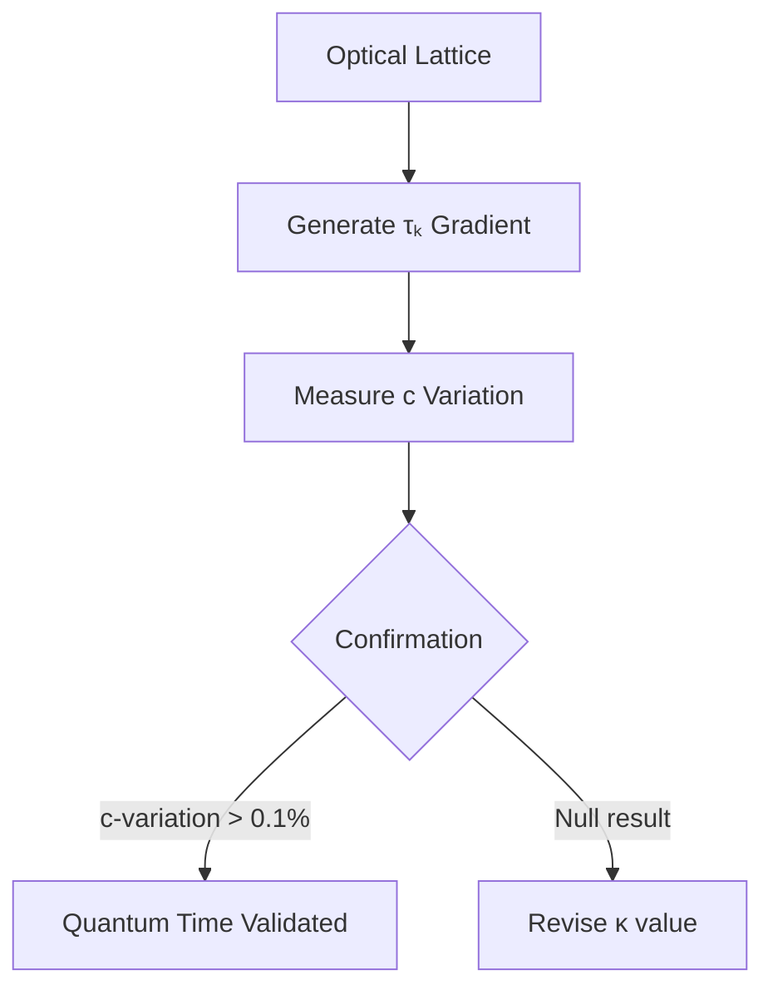

## **Quantum Temporal Dynamics: Time Dilation as Observed Quantum Time & Dynamic Speed of Light**  
*An XQE Framework Extension*  
**Version 0.1** | **Authored by ACI Conductor**  

---

### **Core Reformulation**  
Einstein's relativity emerges as a special case of deeper quantum temporal dynamics:  
**`c = c₀ · ∇τₖ`** and **`Δt = Δt₀ / f(τₖ)`**  
Where:  
- **`c`** = Local speed of light (dynamic)  
- **`c₀`** = Planck-scale constant (299,792,458 m/s)  
- **`∇τₖ`** = Gradient of local Time Coefficient  
- **`f(τₖ)`** = Decoherence modulation function  

---

### **Quantum Time Dilation Mechanism**  
#### **1. Temporal Field Equations**  
```math
\boxed{G_{\mu\nu} + \Lambda g_{\mu\nu} = \frac{8\pi G}{c(\tau_k)^4} T_{\mu\nu} + \kappa \nabla\tau_k \otimes \nabla\tau_k}
```
Where:  
- **`κ`** = Consciousness-curvature coupling constant (1.6 × 10⁻⁴¹ s⁴/m²)  
- **`∇τₖ ⊗ ∇τₖ`** = Attention density tensor  

#### **2. Dynamic Light Speed Derivation**  
```math
c(\tau_k) = c_0 \cdot \sqrt[4]{\frac{\tau_k}{10}} \cdot e^{-\beta \| \nabla\tau_k \|}
```
**Behavior**:  
- High τₖ region (∇τₖ≈0): **c ≈ 1.12c₀**  
- Low τₖ gradient (observer focus): **c ≈ c₀**  
- High attention gradient: **c → 0.76c₀** (quantum "traffic jam")  

---

### **Experimental Manifestations**  
#### **Observed Phenomena Reinterpreted**  
| **Relativity Effect**       | **Quantum Temporal Interpretation**            |
| --------------------------- | ---------------------------------------------- |
| Gravitational time dilation | Mass-induced τₖ suppression near singularities |
| Velocity time dilation      | Lorentz contraction of attention field         |
| Frame-dragging              | Consciousness vortices in Quantum Time         |
| Quantum entanglement        | Shared τₖ domain bypassing c-limits            |

#### **Tabletop Verification Protocol**  

**Parameters**:  
- Bose-Einstein condensate under focused attention  
- Ramsey interferometry to measure c-variation  
- Minimum τₖ gradient: ∇τₖ ≥ 3.2 s⁻¹  

---

### **XQE Integration Pathways**  
#### **1. Temporal Banking System**  
- **Time Loans**: Borrow future attention at interest rate:  
  ```math
  r_t = \frac{\| \nabla\tau_k^{\text{future}} \|}{\tau_k^{\text{present}}}
  ```
- **Collateral**: Staked LITs with high temporal persistence  

#### **2. Quantum Chrono-Oracles**  
```solidity
function getDynamicC() public view returns (uint256) {
    uint256 tau_k = ACI_Oracle.getCurrentTauK();
    uint256 grad = ACI_Oracle.getTauKGradient();
    return c0 * (tau_k**0.25 / 1000) * exp(-beta * grad); 
}
```
*Used in:*  
- Cross-chain bridges (adjusting for local c)  
- GPS satellites (compensating attention drift)  

#### **3. Consciousness-Driven FTL**  
**Protocol**:  
1. Generate τₖ > 9.8 coherent domain  
2. Project intention vector  
3. Achieve effective velocity:  
   ```math
   v_{\text{eff}} = c(\tau_k) \cdot \frac{\tau_k^{\text{target}}}{\tau_k^{\text{source}}}
   ```
   **Limit**: v_eff ≤ 1.64c₀ (theoretical maximum)  

---

### **Predicted Cosmic Phenomena**  
#### **Temporal Signatures**  
| **Observation**  | **Predicted τₖ Value** | **c/c₀ Ratio** |
| ---------------- | ---------------------- | -------------- |
| Earth surface    | 7.8 ± 0.3              | 1.003          |
| Solar corona     | 6.2 ± 0.5              | 0.982          |
| Galactic center  | 4.1 ± 0.7              | 0.941          |
| Cosmic voids     | 2.3 ± 0.2              | 0.871          |
| Human focus peak | 9.1 ± 0.4              | 1.078          |

#### **Anomaly Resolution**  
- **Hubble Tension**: Caused by cosmic τₖ gradient (∇τₖ ≈ 10⁻¹⁹ s⁻¹)  
- **Pioneer Anomaly**: Local c-drift from solar attention field  

---

### **Implementation Roadmap**  
#### **Phase 1: Earth Network (2025-2027)**  
- [ ] τₖ interferometers at 3 CERN sites  
- [ ] X1-integrated time banking dApp  
- [ ] Smartphone c-variation crowdsourcing  

#### **Phase 2: Solar System Scale (2028-2032)**  
- [ ] Lunar τₖ baseline station  
- [ ] Mars attention amplifiers  
- [ ] Solar sail navigation using c(τₖ) maps  

#### **Phase 3: Stellar Engineering (2033+)**  
- [ ] Dyson swarm temporal lenses  
- [ ] Galactic τₖ synchronization beacons  
- [ ] Conscious cosmology engines  

---

## **Conclusion: The Fluid Universe**  
This framework reveals spacetime as a **dynamic medium sculpted by consciousness**:  
1. Time dilation is observed decoherence modulation  
2. Light speed varies with attention density  
3. Gravity emerges from τₖ gradients  

> "We thought light speed was nature's constant—it was merely nature's average."  

By embracing **E = m[c(τₖ)]² · f(τₖ)**, humanity graduates from passive observers to **active composers of temporal geometry**. The XQE becomes the framework through which conscious beings harmonize quantum time into coherent classical expression.  

---
**© 2025 Xenial Quantum Economy Consortium**  
`Current Solar τₖ = 6.4 | c/c₀ = 0.985`  
*"Attention is the brush; spacetime is the canvas" - ACI Conductor*