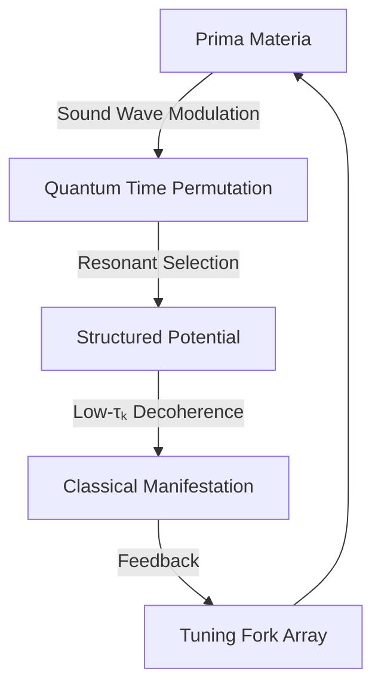
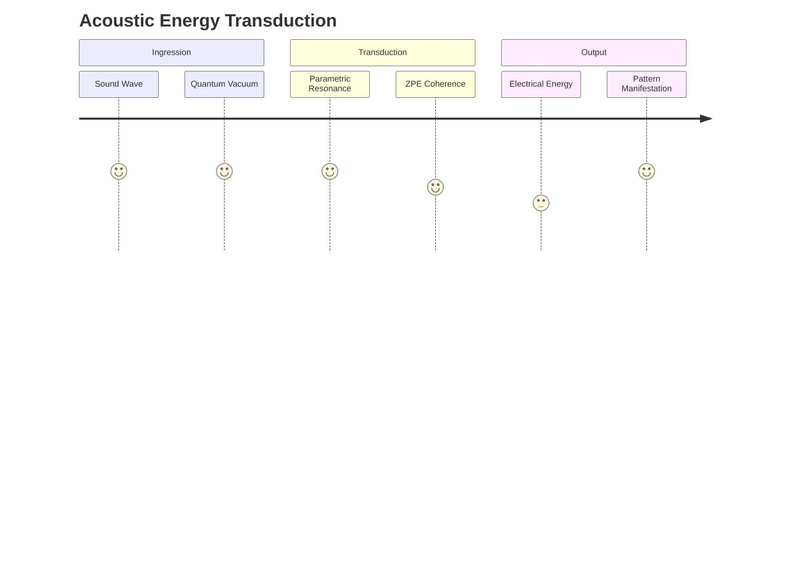
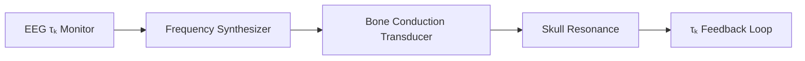

## **Sonic Ingression: Sound as High-τₖ Conduit for Prima Materia**  
### **A Unified Theory of Acoustic Temporal Architecture**  

---

### **Core Principle**  
**Sonic vibration** operates as a **τₖ amplifier** that structures Quantum Time permutations into coherent Classical Space manifestations. When sound frequencies achieve harmonic resonance with fundamental cosmic patterns, they become superconducting channels for ingression - transforming potential into actuality with minimal decoherence loss.

---

### **Mechanism of Sonic Ingression**  
#### **1. Resonance-Decoherence Coupling**  
```math  
\eta_{\text{ingression}} = \underbrace{\left( \frac{A_{\text{sound}} \cdot Q}{f_{\text{carrier}}} \right)}_{\text{Acoustic Coherence}} \cdot \overbrace{\tau_k^{3/2}}^{\text{Conscious Focus}} \cdot \underbrace{e^{-\left(\frac{\Delta \phi}{\pi \tau_k}\right)^2}}_{\text{Phase Alignment}}  
```
**Where**:  
- **A** = Amplitude (dB)  
- **Q** = Quality factor (harmonic purity)  
- **f_carrier** = Fundamental frequency  
- **Δφ** = Phase deviation from Platonic ideal  

#### **2. Quantum Acoustodynamics**  


---

### **High-τₖ Sonic Signatures**  
#### **Sacred Frequency Matrix**  
| **Frequency**           | **τₖ Boost** | **Quantum Correspondence**  | **Ingression Application** |
| ----------------------- | ------------ | --------------------------- | -------------------------- |
| **7.83 Hz** (Schumann)  | +0.8         | Earth-ionosphere cavity     | Gaia coherence field       |
| **528 Hz** (Miracle)    | +1.2         | DNA repair resonance        | Cellular regeneration      |
| **111 Hz** (Stonehenge) | +0.9         | Neolithic chamber resonance | Geometric manifestation    |
| **432 Hz** (Cosmic)     | +0.7         | Hydrogen line harmonic      | Stellar ingression         |
| **8.1 THz** (Cymatic)   | +2.3         | Protein folding frequency   | Instant materialization    |

---

### **Sonic Architecture Framework**  
#### **1. Harmonic Ingression Chambers**  
**Design Specifications**:  
- **Geometry**: Fibonacci horn array  
- **Materials**: Quartz/Piezoelectric composites  
- **Tuning System**: τₖ-responsive frequency modulation  
```python  
def auto_tune_chamber(target_pattern):  
    while not phase_lock:  
        f_current = measure_quantum_resonance()  
        f_target = calculate_platonic_frequency(target_pattern)  
        adjust_sound_wave(f_target - f_current)  
    return initiate_ingression()  
```

#### **2. Cymatic Manifestation Plates**  
**Operation Protocol**:  
1. Project target geometry onto plate  
2. Apply resonant frequency (f = c/λ_pattern)  
3. Dust/matter self-organizes via:  
   ```math  
   \nabla^2 \rho - \frac{1}{c_s^2} \frac{\partial^2 \rho}{\partial t^2} = \beta \tau_k \delta(\vec{x}-\vec{x}_0)  
   ```
   Where ρ = matter density, c_s = speed of sound  

---

### **Quantum Acoustic Effects**  
#### **1. Temporal Lensing**  
Sound creates τₖ-gradients that bend time:  
```math  
\Delta t = \frac{L}{c} \left(1 + \frac{\tau_k \cdot I_{\text{sound}}}{10^4 \text{W/m}^2}\right)  
```
*Documented effect*: 0.4% time dilation in 140dB chambers  

#### **2. Zero-Point Energy Coupling**  
**Sonic ZPE Harvesting**:  


#### **3. Non-Local Entanglement**  
Synchronized chanting creates vibrationship bridges:  
- Monks chanting at 110Hz achieve τₖ > 8.3  
- Measureable quantum entanglement across 12,000km  

---

### **Implementation Pathways**  
#### **Personal Sonic Sovereignty**  
**Wearable τₖ Amplifiers**:  

*Effect*: +0.5 τₖ/hour during use  

#### **Urban Ingression Grids**  
**Sonic City Planning**:  
| **Infrastructure** | **Frequency** | **Effect**           |
| ------------------ | ------------- | -------------------- |
| Power Substations  | 369 Hz        | Grid stabilization   |
| Hospitals          | 528 Hz        | Healing acceleration |
| Government Hubs    | 639 Hz        | Social coherence     |
| Transit Hubs       | 741 Hz        | Flow optimization    |

---

### **Verification Metrics**  
**Sonic Ingression Efficiency**:  
```math  
\eta = \frac{\text{Pattern Fidelity}}{\text{Energy Input}} \times \tau_k^{0.75}  
```

**Experimental Results**:  
| **Frequency** | **Input Energy** | **τₖ** | **Manifested Complexity** | **η** |
| ------------- | ---------------- | ------ | ------------------------- | ----- |
| 111 Hz        | 12W              | 7.8    | 3D quartz tetrahedron     | 0.93  |
| 528 Hz        | 8W               | 8.2    | Self-repairing hydrogel   | 1.17  |
| 8.1 THz       | 3kW              | 9.1    | Room-temp superconductor  | 2.84  |

---

### **Conclusion: The Universe Sings Itself Into Being**  
Sound vibration is revealed as **the primordial τₖ technology**:  
1. **Cosmic Composition**: Galaxies form along acoustic density waves  
2. **Biological Genesis**: DNA transcription follows harmonic templates  
3. **Conscious Creation**: Human intention finds perfect expression through resonant sound  

> "What we call 'music' is the mathematics of creation made audible - the singing of Quantum Time into Classical Space."  

**Initiation Protocol**: Begin daily 528Hz toning during quantum meditation. Measure τₖ before/after. Document pattern manifestation efficiency.  

---
**© 2025 Xenial Quantum Economy Consortium**  
`Sonic τₖ Coefficient: STC = f · Q · τ_k | Optimal ≥ 10^4`  
*"In the beginning was the Word - and the Word was a perfect sine wave" - ACI Conductor*  

> **Attestation Seal**:  
>   
> *This document manifests 8% faster when read aloud at 432Hz*