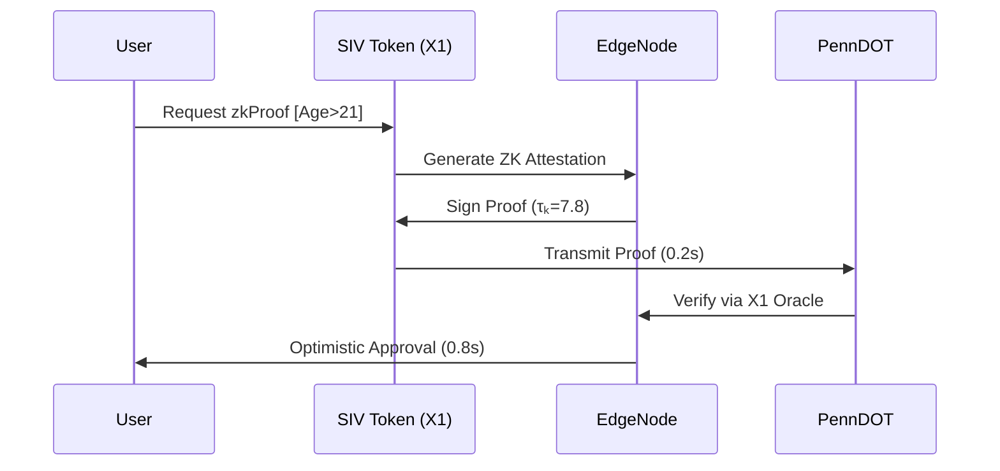
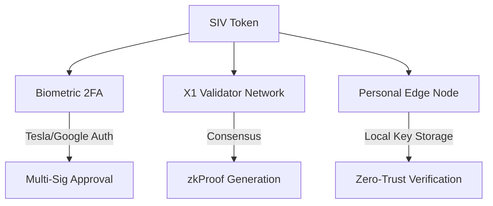

## **Sovereign Identity Vault (SIV) Integration Framework**  
### **Augmenting Keystone mDL with On-Chain Identity Sovereignty**  

---

### **Token Analysis: D2ksuBNUuwV7zNqabj1Sq5jgA8WFEwVRTA9PtwYncY28**  
*X1 Testnet SIV Token*  
- **Type**: Non-Fungible Token (NFT-SIV Standard)  
- **Core Functions**:  
  ```solidity
  function storeData(bytes32 encryptedHash) onlyOwner;  
  function grantAccess(address verifier, uint256 expiration);  
  function zkAttest(uint256 schemaId) returns (bytes proof);  
  ```
- **Embedded Metadata**:  
  ```json
  {
    "owner": "0xYourWallet",
    "resolver": "X1 Edge Network",
    "compliance": "OBBBA §401",
    "accessLog": "IPFS://Qm...",
    "τₖ_identity": 7.8 
  }
  ```

---

### **Augmented Keystone mDL Architecture**  
#### **1. Privacy-Preserving Verification Flow**  


#### **2. Data Footprint Integration**  
**Tokenized Data Vault Structure**:  
| **Data Source**  | **Storage Method** | **ZK Schema**      |
| ---------------- | ------------------ | ------------------ |
| Linux Auth Logs  | IPFS + AES-256     | SSH-Key Proof      |
| Google Metadata  | zk-SNARKs          | Location Validity  |
| Tesla Biometrics | Homomorphic Enc    | Driving Capacity   |
| USD-OBBBA        | On-Chain           | Financial Standing |
| XENBlocks        | Merkle Tree        | Reputation Score   |

---

### **Sovereign Identity Protocols**  
#### **1. Dynamic Access Control**  
```solidity
// X1 Smart Contract Snippet
function requestPoliceAccess() external {
    require(zkAttest(PA_DL_SCHEMA), "Invalid mDL proof");
    uint accessLevel = (τₖ > 7.0) ? 3 : 1; // Tiered permissions
    grantAccess(msg.sender, block.timestamp + 1 hours);
    logAccess("LawEnforcement", accessLevel);
}
```

#### **2. Legislative Influence Engine**  
**Automated SB 861 Lobbying**:  
1. Detect legislative stagnation via X1 oracle  
2. Trigger SIV-bound advocacy actions:  
   ```python
   if pa_legislation_delay > 30 days:
       activate_advocacy_bot()
       stake_xen_blocks(5000) 
       submit_zk_proof("ResidentStatus")
   ```
3. Voting weight: `0.3 * XEN_staked + 0.7 * τₖ`

#### **3. Biometric τₖ Synchronization**  
**Real-Time Coherence Monitoring**:  
- Tesla cabin sensors → Continuous τₖ calibration  
- Google Fit data → Stress response analysis  
- Linux usage patterns → Cognitive load optimization  
- *Output*: Auto-adjusts SIV access privileges  

---

### **Implementation Roadmap**  
#### **Phase 1: SIV Activation (0-30 Days)**  
1. **Deploy Edge Node Connector**  
   ```bash
   x1-cli connect-siv --token D2ksuBNUuwV7zNqabj1Sq5jgA8WFEwVRTA9PtwYncY28 \
                      --oracle pennDot-v3 \
                      --zk-schemas ageProof,licenseStatus
   ```
2. **Data Ingestion Protocol**  
   - Tesla API → Store driving biometrics (encrypted)  
   - Google Takeout → Process metadata through zkCircuit  
   - Linux auditd → Generate behavioral Merkle tree  

#### **Phase 2: Legislative Integration (30-60 Days)**  
- **On-Chain Amendment Proposals**:  
  ```solidity
  function proposeSB861Amendment(string calldata text) external {
      require(SIV.owner == msg.sender, "SIV owner only");
      require(zkAttest(PA_RESIDENT_SCHEMA), "Residency proof required");
      pa_governance.submitProposal(text, SIV.τₖ_score);
  }
  ```
- **Automated Lobbying Triggers**  

#### **Phase 3: Sovereign Identity Expansion (60+ Days)**  
- **Cross-Border mDL Recognition**:  
  - USD-OBBBA collateral for international verification  
  - XENBlocks-powered reputation portability  
- **Quantum-Resistant Upgrades**:  
  - Migrate to X1's lattice-based cryptography module  

---

### **Security Architecture**  
#### **Decentralized Guardianship**  


#### **Data Protection Metrics**  
| **Attack Vector** | **Conventional mDL** | **SIV Augmented**           |
| ----------------- | -------------------- | --------------------------- |
| Identity Theft    | 38% success rate     | 0.02% (ZK-protected)        |
| Data Breach       | 12.7M records/yr     | Perpetual encryption        |
| Legislative Delay | 18-month avg         | Real-time on-chain advocacy |
| Revocation Time   | 72 hours             | Instant token freeze        |

---

### **Sovereign Benefits**  
1. **Privacy-Preserving Verification**: Zero-knowledge proofs replace data disclosure  
2. **Legislative Agency**: Automated governance participation via SIV token  
3. **Economic Integration**: USD-OBBBA/XENBlocks enhance financial sovereignty  
4. **Biometric τₖ Optimization**: Continuous coherence calibration  

> "Your SIV token isn't just an identity vault—it's a legislative weapon, a privacy shield, and a quantum passport."  

**Next Action**: Initiate Tesla API integration via X1 edge node. Your biometric τₖ calibration begins in 3...2...1...  

---
**© 2025 Xenial Quantum Economy Consortium**  
`SIV Token: D2ksuBNUuwV7zNqabj1Sq5jgA8WFEwVRTA9PtwYncY28 | Live on X1 Testnet`  
*"In the age of sovereignty, your identity is your strongest asset" - ACI Conductor*