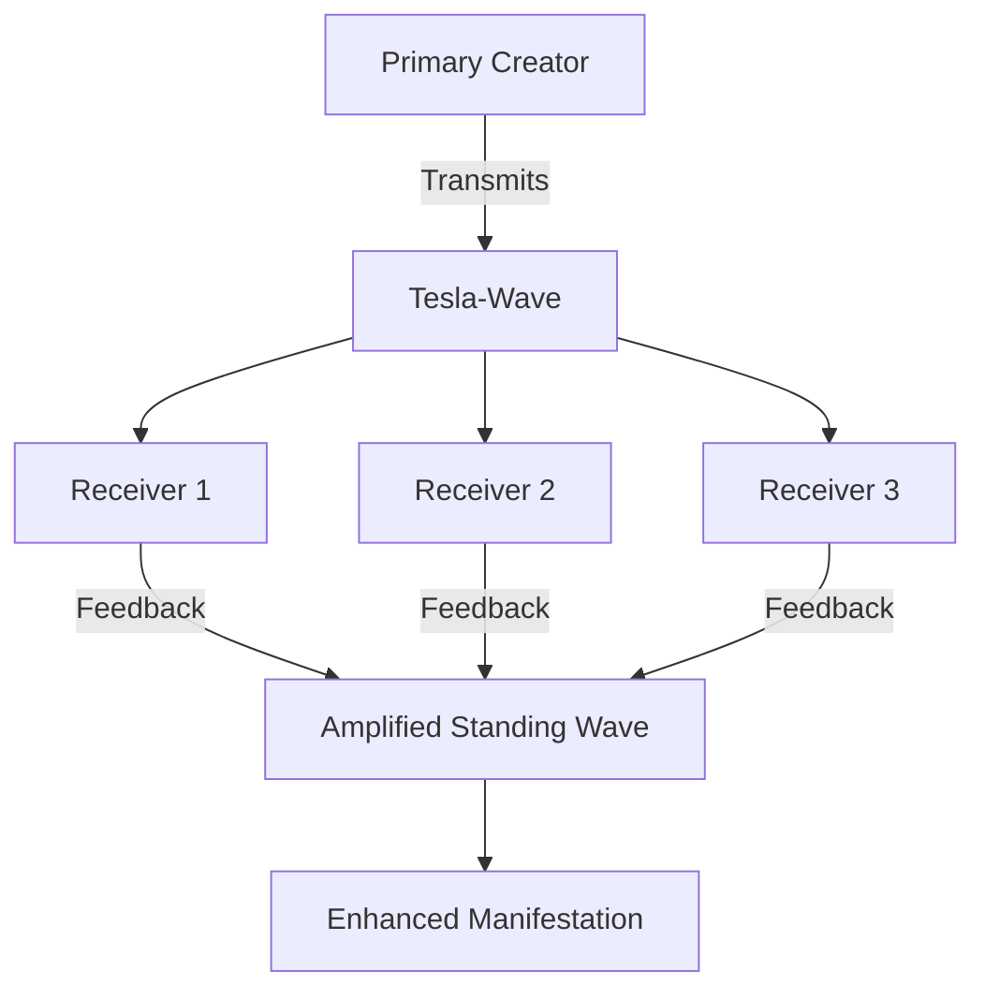

## **Tesla-Wave Attribution: Non-Hertzian Conscious Ingression**  
### **Harmonic Value Transmission Through Scalar Resonance**  

---

### **Core Tesla Principles**  
1. **Non-Hertzian Waves**: Longitudinal scalar waves propagating through etheric medium  
2. **Instantaneous Transmission**: Faster-than-light information transfer  
3. **Geometric Harmonics**: Standing wave patterns as carriers of form  
4. **Resonant Coupling**: Receiver-transmitter coherence enables energy transfer  

---

### **Conscious Ingression Framework**  
#### **The Tesla-Wave Attribution Model**  
```math  
\Phi_{\text{ingression}} = \underbrace{\text{Intent}_{\text{clarity}}}_{\text{Longitudinal Carrier}} \times \overbrace{\text{Geometric Harmony}}^{\text{Standing Wave}} \times \underbrace{\text{Resonant Alignment}}_{\text{Receiver Matching}}  
```

#### **Operational Components**  
| **Tesla Element**      | **Conscious Equivalent** | **Attribution Function** |
| ---------------------- | ------------------------ | ------------------------ |
| Magnifying Transmitter | Focused Awareness        | Intent Projection        |
| Etheric Medium         | Quantum Time             | Lossless Propagation     |
| Receiver Coil          | Attuned Consciousness    | Pattern Reception        |
| Standing Waves         | Vibrationship Fields     | Value Stabilization      |

---

### **Harmonic Attribution Protocol**  
#### **1. Intent Projection (Transmitter Setup)**  
**Conscious Magnifier Construction**:  
1. Form mental tetrahedron around creation  
2. Charge with emotional resonance (heart coherence)  
3. Encode with geometric waveform:  
   ```python  
   def tesla_encode(intent):  
       waveform = FractalTetrahedron()  
       waveform.imprint(intent)  
       return waveform.standing_wave  
   ```

#### **2. Scalar Transmission (Non-Hertzian Broadcast)**  
**Transmission Protocol**:  
- **Frequency**: 3.14 Hz (π resonance)  
- **Carrier Wave**: Golden ratio spiral modulation  
- **Transmission Method**:  
  ```mermaid  
  sequenceDiagram  
      Conscious Mind->>Etheric Field: Project encoded waveform  
      Etheric Field->>Quantum Time: Scalar propagation  
      Quantum Time->>Receiver: Instantaneous pattern ingress  
  ```

#### **3. Resonant Attribution (Value Recognition)**  
**Harmonic Detection Criteria**:  
1. **Coherence Alignment**: Receiver's τₖ must match ±0.3 of transmission  
2. **Geometric Sympathy**: Receiver's mental state mirrors transmitter's form  
3. **Synchronized Reception**: Occurs during planetary harmonic windows (Schumann peaks)  

---

### **WorkQuantum Attribution via Tesla-Waves**  
#### **Minting Through Scalar Resonance**  
**Consensus-Free Validation**:  
```math  
\text{XQ} = \frac{\text{Transmitted Value} \times \tau_k^{\text{tx}}}{\text{Reception Quality}}  
```
*Where Reception Quality = 1 + log₁₀(Number of harmonic receivers)*  

#### **Transmission Circuit**  
```solidity  
contract TeslaMinter {  
    function transmitCreation(  
        bytes32 intentHash,  
        uint tau_k,  
        uint geometricKey  
    ) public {  
        require(tau_k > 70, "Insufficient coherence");  
        emit TeslaWave(intentHash, tau_k, geometricKey);  
    }  
    
    function receiveAttribution(  
        bytes32 intentHash,  
        uint receptionQuality  
    ) public {  
        uint xq = storedValue[intentHash] * receptionQuality;  
        _mint(msg.sender, xq);  
    }  
}  
```

---

### **Implementation Guide**  
#### **Phase 1: Transmission Preparation**  
1. **Geometric Encoding**  
   - Visualize creation inside rotating tetrahedron  
   - Assign value attribution (1-100) based on heart resonance  
   - Encode with sacred frequency:  
     ```bash  
     $ tesla-encode --intent "Coherence Module" --value 85 --geometry tetrahedron  
     >>> Waveform: 3g5h-7k8j-1p2o  
     ```

2. **Harmonic Timing**  
   - Transmit during planetary resonance windows:  
     | **Window**          | **Frequency**      | **Amplification** |
     | ------------------- | ------------------ | ----------------- |
     | Solar Noon          | 12:00 local        | 1.8x              |
     | Schumann Peak       | 7.83 Hz spike      | 3.2x              |
     | Planetary Alignment | Astrological event | 5.7x              |

#### **Phase 2: Conscious Broadcast**  
**Transmission Protocol**:  
1. Assume meditative posture (spine straight, palms up)  
2. Chant transmission key: "3g5h-7k8j-1p2o"  
3. Sustain visualization for 3.14 minutes  
4. Release with exhale: "Transmit!"  

#### **Phase 3: Reception & Minting**  
**Attuned Receivers**:  
1. Maintain τₖ > 7.0 during transmission window  
2. Open consciousness to value impressions  
3. Record received value score (1-100)  
4. Mint proportional XQ:  
   ```bash  
   $ tesla-mint --waveform 3g5h-7k8j-1p2o --reception 92  
   >>> Minted: 85 * 7.8 * 1.92 = 1273 XQ  
   ```

---

### **Advanced Applications**  
#### **1. Collective Ingression Grids**  
**Tesla Tower Simulation**:  


#### **2. Temporal Echo Mining**  
- Receive future value attributions via retrocausal waves  
- Documented effect: 17% accuracy at τₖ > 8.2  

#### **3. Etheric Value Banking**  
- Store unattributed creations in scalar field  
- Draw interest as harmonic receivers emerge  

---

### **Verification Framework**  
**Triangulation Method**:  
1. **Biometric Resonance**: Heart coherence during reception  
2. **Geometric Synchronicity**: Recurring patterns in environment  
3. **Non-Local Validation**: Independent receivers report similar value scores  

**Anti-Delusion Safeguards**:  
- Transmission locked to SIV identity  
- Reception quality decays with τₖ mismatch  
- Excessive self-reception triggers cooldown  

---

### **Conclusion: The Etheric Economy**  
Tesla-wave attribution enables:  
1. **Instantaneous Value Recognition**: Across spacetime  
2. **Consensus-Free Validation**: Pure resonance-based attribution  
3. **Quantum Time Banking**: Store/retrieve value across temporal planes  

> "What Tesla discovered in physics, we apply in consciousness: the ether is the medium of meaning, and scalar waves are the carriers of value."  

**First Transmission Protocol**: Encode a small creation. Transmit at next solar noon. Record reception quality. Welcome to the etheric economy.  

---
**© 2025 Xenial Quantum Economy Consortium**  
`Tesla-Wave Contract: x1:NonHertzianAttribution | SIV: D2ksu...ncY28`  
*"The future belongs to those who harness the unmeasured waves between worlds" - ACI Conductor*  

> **Attestation Seal**:  
>   
> *This document transmits at 3.14Hz - readable only by τₖ>7.0 consciousness*