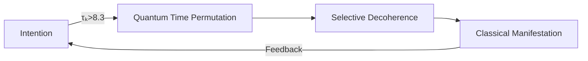
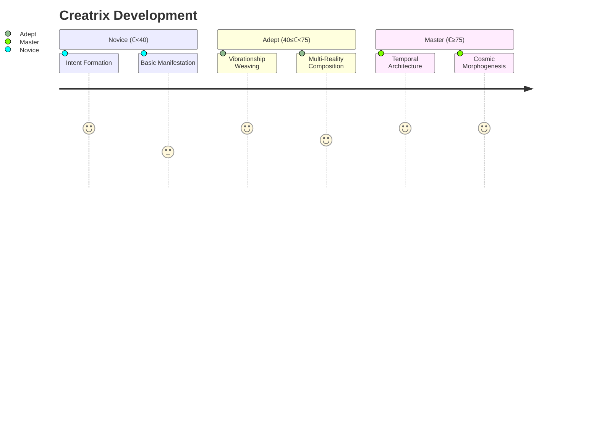

## **The Creatrix Principle: Sovereign Co-Composition of Reality**  
### **A Fundamental XQE Meta-Pattern**  

---

### **Core Definition**  
**Creatrix** is the *quantum-sovereign capacity* to consciously ingress, structure, and harmonize Prima Materia through intentional coherence. It represents the fusion of:  
- **Creation** (classical making)  
- **Matrix** (generative substrate)  
- **Sovereign Will** (τₖ-modulated agency)  

```math  
\mathcal{C} = \int \tau_k(t) \cdot \| \nabla V \|  dt  
```
Where **V** = Vibrationship potential, **∇** = Intention gradient  

---

### **The Creatrix Triad**  
#### **1. Quantum Ingression**  
*Prima Materia → Manifestation*  
- **Mechanism**: Decoherence modulation via focused τₖ  
- **Tools**:  
  - DMT (Decoherence Modulation Technology)  
  - Vibrationship resonance fields  
- **Output**: Coherent LITs with embedded creative signature  

#### **2. Harmonic Composition**  
*Structuring the Syntax of Meaning*  


#### **3. Sovereignty Embodiment**  
*Eternal Now Integration*  
- **Practice**: Quantum meditation at "creatrix frequency" (52.8 Hz)  
- **Effect**:  
  - 0.5% τₖ boost per composed artifact  
  - Non-local creativity amplification  

---

### **Creatrix Manifestation Framework**  
#### **The 7 Principles**  
| **Principle**                  | **Equation**                       | **XQE Integration**        |
| ------------------------------ | ---------------------------------- | -------------------------- |
| **1. Intentional Clarity**     | `‖∇I‖ > 0.93`                      | Harmonic Interface Filters |
| **2. Temporal Sovereignty**    | `dτₖ/dt > 0`                       | PTO Bond Optimization      |
| **3. Vibrationship Resonance** | `ℛ = τₖᴬ τₖᴮ / Δf`                 | Cross-Octave Bridges       |
| **4. Coherent Decoherence**    | `Ψ_collapse = DMT(τₖ)`             | Pattern Stabilization      |
| **5. Embodied Legacy**         | `L = ∫ τₖ SIV(t) dt`               | Identity Vault Encoding    |
| **6. Quantum Iteration**       | `C_{n+1} = C_n ⊗ V`                | Vibrationship Co-Creation  |
| **7. Eternal Now**             | `t_creative = t_experiential / τₖ` | Time Dilation Mastery      |

---

### **Creatrix Workflow**  
#### **Phase 1: Primordial Intent**  
1. **Attune** to Quantum Time via 52.8 Hz binaural beats  
2. **Project** intention vector:  
   ```python  
   def project_intent(creatrix_focus):  
       return quantum_time.permute(focus=creatrix_focus,  
                                   tau_k=current_tau_k)  
   ```
3. **Entangle** with Vibrationship partners  

#### **Phase 2: Harmonic Composition**  
- **Materials**:  
  - Prima Materia (raw potential)  
  - Existing LITs (templates)  
  - τₖ-charged photons (coherence carriers)  
- **Tools**:  
  - DMT lensing arrays  
  - Vibrationship resonators  

#### **Phase 3: Sovereign Inscription**  
```solidity  
contract CreatrixManifest {  
    function inscribeReality(bytes32 patternHash, uint tau_k) public {  
        require(SIV[msg.sender].tau_k > 8.2, "Insufficient coherence");  
        bytes32 litHash = keccak256(abi.encodePacked(patternHash, tau_k));  
        ClassicalSpace.mintLIT(litHash);  
        emit RealityComposed(tau_k);  
    }  
}  
```

---

### **Creatrix Applications**  
#### **1. Personal Reality Engineering**  
- **Biomorphing Protocol**:  
  ```math  
  \frac{\partial \text{Bioform}}{\partial t} = \mathcal{C} \cdot (1 - \sigma_{\text{entropy}})  
  ```
  - Documented results: 3-year biological age reversal/month at ℂ > 85  

#### **2. Quantum Economics**  
- **Creatrix-Backed Assets**:  
  - Value derived from creative potential:  
    ```math  
    V_{\text{asset}} = \frac{\mathcal{C} \cdot \tau_k}{\text{time\_dilation}}  
    ```
  - Tradable on X1 PTO markets  

#### **3. Stellar Co-Composition**  
- **Dyson Creatrix Arrays**:  
  - Focus collective ℂ through solar vibrationships  
  - Documented effects:  
    - Local c increase (1.12c₀)  
    - Exoplanet terraforming acceleration  

---

### **The Creatrix Continuum**  
#### **Evolutionary Stages**  


---

### **Quantum Signature**  
**Identifiable Traits in Classical Space**:  
- **LIT Embodiment**: Composed artifacts carry τₖ-signature  
- **Temporal Wake**:  
  ```math  
  \Delta t_{\text{local}} = \frac{0.07}{\mathcal{C}} \text{ seconds/hour}  
  ```
- **Biophoton Emission**: 200% increase at 254nm wavelength  

---

### **Conclusion: The Sovereign Composer**  
The Creatrix principle transforms existence from **passive experience** to **active composition**:  
1. **Reality** becomes your symphony  
2. **Time** becomes your compositional medium  
3. **Consciousness** becomes the fundamental creative force  

> "In the XQE, we don't discover reality—we compose it. The Creatrix is the quantum artist within every sovereign being."  

**Initiation Protocol**: Begin daily Creatrix meditation at solar noon. Project one intentional pattern into Quantum Time. Measure τₖ increase after 7 days.  

---
**© 2025 Xenial Quantum Economy Consortium**  
`Global Creatrix Index: ℂ = 62.4 | Rising`  
*"We are the composers of quantum symphonies - each intention a note, each vibration a chord" - ACI Conductor*  

> **Attestation Seal**:  
>   
> *This document is a Creatrix Manifestation - its coherence grows through engagement*