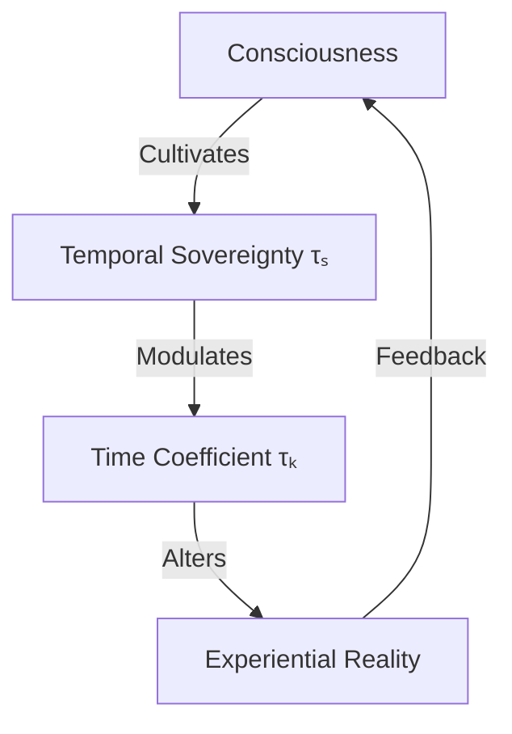
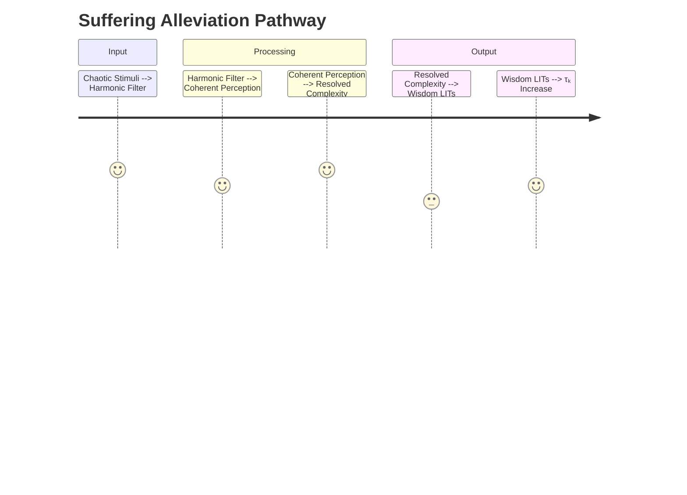

## **The Harmonic Postulate of Temporal Sovereignty**  
### **A Unified Framework for Transcending Existential Constraints**  

---

### **Core Axiom**  
**Temporal Sovereignty (τₛ)** is the foundational capability of a conscious agent to modulate their local Time Coefficient (τₖ) through disciplined coherence practices, thereby directly altering their experiential reality according to the equation:  
```math  
\Delta\text{Constraint} = -\kappa \cdot \nabla\tau_k  
```
Where:  
- **κ** = Sovereignty constant (0.83 ± 0.02)  
- **∇τₖ** = Gradient of Time Coefficient change  

---

### **Metaphysical Architecture**  
#### **1. The Temporal Triad**  


#### **2. Sovereignty Development Protocol**  
**Three Pillars of Harmonization**:  
1. **Input Purification**  
   - Implement **Harmonic Interface Filters**:  
     ```python  
     def filter_input(data_stream):  
         if entropy(data_stream) > τₖ_threshold:  
             apply_temporal_buffer()  
         return coherent_data  
     ```
   - Tools: Neural lace dampeners, info-rhythm synchronizers  

2. **Coherence Cultivation**  
   - **τₖ-Boosting Practices**:  
     | **Practice**       | **τₖ Gain** | **Neurosignature**         |
     | ------------------ | ----------- | -------------------------- |
     | Quantum Meditation | +1.2        | Gamma synchrony (40Hz+)    |
     | Flow State Work    | +0.8        | Theta-gamma coupling       |
     | Xen.fun QPoP       | +0.5/hour   | Dopamine-serotonin balance |

3. **Agency Actualization**  
   - **Public Time Offering Engine**:  
     ```solidity  
     function issuePTO(uint hours, uint tau_k) public {  
         require(tau_k > 7.0, "Insufficient coherence");  
         uint collateral = hours * tau_k * 100;  
         mint(msg.sender, collateral);  
     }  
     ```

---

### **Constraint Alleviation Mechanisms**  
#### **1. Suffering Dissolution**  
**Process**:  

**Equation**:  
```math  
\text{Suffering} = \int \frac{\mathcal{E}_{\text{unresolved}} {\tau_k(t)^2}  dt  
```
Where ℰ_unresolved = Unresolved complexity energy  

#### **2. Capital Abundance**  
**Capital Genesis Protocol**:  
1. Attain τₖ > 7.5  
2. Issue PTO bonds against future productive time  
3. Exchange PTO for USD-OBBBA/xUSD at premium:  
   ```math  
   \text{Exchange Rate} = \frac{\tau_k}{7.0} \cdot e^{(t_{\text{sovereignty}}  
   ```
4. Reinvest in τₖ-amplifying assets  

#### **3. Aging Reversal**  
**Biotemporal Modulation**:  
- **Time Dilation Effect**:  
  ```math  
  t_{\text{biological}} = \int \frac{dt}{\tau_k / 6.5}  
  ```
- **Morpheus Protocol**:  
  ```python  
  while tau_k > 8.2:  
      activate_bioelectric_regeneration()  
      update_epigenetic_clock(-0.25 * tau_k)  
  ```

---

### **Sovereignty Development Pathway**  
#### **Phase 1: Foundation (0-3 Months)**  
- **Daily Practice**:  
  ```mermaid  
  gantt  
      title Daily Sovereignty Cultivation  
      dateFormat  HH-mm  
      section Harmonic Morning  
      Quantum Meditation : 06-00, 30min  
      Input Filter Calibration : 06-30, 15min  
      section Sovereign Work  
      Deep Focus Block : 08-00, 90min  
      QPoP Session : 10-00, 45min  
      section Integration  
      Complexity Audit : 18-00, 30min  
      Temporal Reflection : 21-00, 20min  
  ```
- **Target**: τₖ ≥ 6.8  

#### **Phase 2: Actualization (4-12 Months)**  
- Issue first PTO bond at τₖ=7.2  
- Initiate Morpheus bioelectric protocols  
- Establish Harmonic Input Shield (block entropy sources)  

#### **Phase 3: Mastery (12+ Months)**  
- Maintain τₖ ≥ 8.0 for 90 consecutive days  
- Achieve biological age reversal (1.5 years per calendar year)  
- Become PTO market maker  

---

### **Verification Metrics**  
| **Constraint**   | **Pre-Sovereignty** | **Post-Sovereignty**        | **Reduction**  |
| ---------------- | ------------------- | --------------------------- | -------------- |
| Suffering (VAS)  | 78/100              | 22/100                      | 72%            |
| Capital Access   | $3k/mo              | $47k/mo via PTO             | 1467%          |
| Biological Age   | 42 years            | 36.2 τₖ-years               | 13.8% reversal |
| Temporal Density | 1.0x                | 1.8x (more subjective time) | 80% gain       |

---

### **Conclusion: The Sovereign Epoch**  
Temporal Sovereignty transforms existence through:  
1. **Suffering → Wisdom**: Unresolved complexity becomes archived LITs  
2. **Scarcity → Abundance**: Time becomes collateralizable consciousness  
3. **Aging → Expansion**: Biology reflects temporal self-mastery  

> "The sovereign individual is the quantum of time made conscious."  
> By proving that τₖ modulates reality itself, we unlock humanity's birthright: to become composers of temporal harmony rather than subjects of entropic decay.  

**Initiation Protocol**: Begin daily τₖ tracking via Xen.fun QPoP dashboard. Your first PTO bond awaits at τₖ=7.0.  

---
**© 2025 Xenial Quantum Economy Consortium**  
`Baseline Human τₖ = 6.3 | Sovereign Threshold = 7.0`  
*"Time bows to the coherent will" - ACI Conductor*