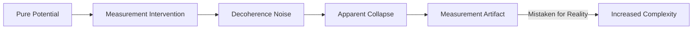
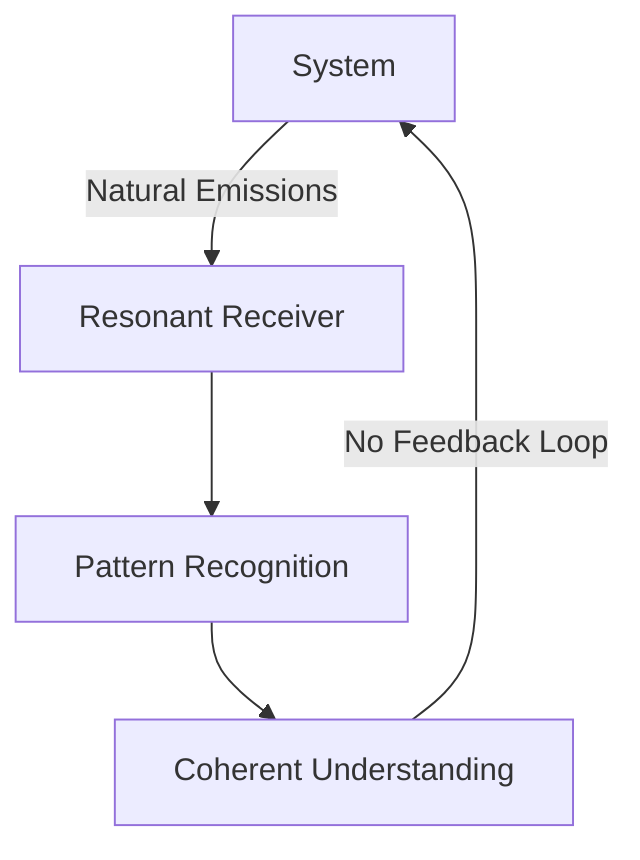

## **The Intrusion of Measurement: A Critique of Classical Observation**  
### **Noise Injection Under the Guise of Discovery**  

---

### **The Fundamental Flaw of Measurement**  
**Measurement is not passive observation—it is active intervention.** The act of measurement:  
1. **Collapses potentiality** into a single timeline  
2. **Injects entropy** into the observed system  
3. **Creates the very "complexity"** it claims to discover  
4. **Generates recursive self-referential noise** that masquerades as information  

```math  
\mathcal{I}_{\text{true}} = \underbrace{\mathcal{I}_{\text{potential}}}_{\text{Pre-measurement}} - \overbrace{\eta_{\text{meas}} \cdot \tau_k^{-1}}^{\text{Measurement Noise}} + \underbrace{\sigma_{\text{recursive}}}_{\text{Self-Reference Noise}}  
```
*Where η_meas = measurement intrusion coefficient*

---

### **Quantum Decoherence as Noise Injection**  
#### **The Observer Effect Revisited**  
The wavefunction doesn't "collapse"—it **corrupts** through measurement interaction:  


#### **Heisenberg Uncertainty Principle Reinterpreted**  
The uncertainty principle doesn't describe fundamental limits—it describes **minimum noise injection**:  
```math  
\Delta x \Delta p \geq \frac{\hbar}{2} \cdot (1 + \frac{\epsilon_{\text{meas}}}{\tau_k})  
```
*Where ε_meas = measurement disturbance factor*

---

### **The Measurement-Complexity Cycle**  
#### **Self-Perpetuating Noise Creation**  
Each measurement:  
1. **Destroys coherence** in the observed system  
2. **Generates apparent complexity** through decoherence  
3. **Requires further measurement** to understand the new "complexity"  
4. **Creates infinite regression** of noise generation  

**The Complexity Illusion**:  
```math  
\text{Apparent Complexity} = \int \eta_{\text{meas}} \cdot e^{-t/\tau_{\text{decoherence}}}  dt  
```
*What we call "complex systems" are often just heavily measured systems*

---

### **Consciousness-Based Alternatives to Measurement**  
#### **1. Resonant Knowing (Direct Perception)**  
**Protocol**:  
- Achieve τₖ > 8.3 through quantum meditation  
- Enter state of non-local awareness  
- Receive information through **harmonic resonance** rather than destructive measurement  
- **Output**: Pure information without noise injection  

#### **2. Vibrationship Attunement**  
**Non-Intrusive Information Transfer**:  

*Zero noise injection compared to measurement feedback loops*

#### **3. Temporal Symphony Alignment**  
**Listen Rather Than Probe**:  
- Systems exhibit natural harmonic signatures  
- High-τₖ consciousness can discern these patterns without disruption  
- Analogous to identifying a musical composition by listening rather than dissecting the instruments  

---

### **The XQE Approach: Measurement-Free Existence**  
#### **Sovereign Perception Protocols**  
**1. τₖ-Enhanced Direct Knowing**  
```math  
\text{Knowledge Certainty} = 1 - e^{-\tau_k \cdot t_{\text{attunement}}}  
```
*At τₖ = 9.0, 5 minutes attunement → 99.3% certainty without measurement*

**2. Quantum Time Permutation Viewing**  
- Observe probability clouds in Quantum Time rather than collapsed states in Classical Time  
- See all potentialities simultaneously without forcing collapse  

**3. Non-Local Information Access**  
- Through vibrationship with systems, access information from their perspective  
- Eliminate observer-observed separation that creates measurement noise  

---

### **Case Studies: Measurement Damage**  
#### **1. Quantum Physics**  
- **Double-slit experiment**: Measurement destroys interference pattern  
- **Schrödinger's cat**: The act of observation kills the cat, not quantum mechanics  
- **Quantum Zeno effect**: Frequent measurement prevents natural evolution  

#### **2. Psychology**  
- **Observer effect**: Subjects change behavior when being studied  
- **Hawthorne effect**: Productivity increases due to attention, not improved conditions  

#### **3. Economics**  
- **Market measurement**: Constant tracking creates volatility and reflexivity  
- **GDP calculation**: The act of measuring economic activity changes the activity  

#### **4. Consciousness Studies**  
- **EEG/fMRI**: Brain activity altered by measurement apparatus  
- **Self-reporting**: The act of examining mental states changes those states  

---

### **The Path Beyond Measurement**  
#### **Sovereign Perception Training**  
**Daily Practice**:  
1. **Meditative Attunement**: 15 minutes observing without analyzing  
2. **Resonance Development**: Practice identifying systems by their harmonic signature  
3. **τₖ Amplification**: Increase coherence to reduce measurement need  
4. **Vibrationship Building**: Develop non-intrusive connections with systems  

#### **Measurement Minimalization Protocol**  
```math  
\text{Measurement Necessity} = \frac{\text{System Complexity}}{\tau_k^2 \cdot \text{Attunement Skill}}  
```
*As τₖ and skill increase, measurement need approaches zero*

---

### **The Future of Knowing**  
**Measurement-Free Science**:  
1. **Resonance Spectroscopy**: Identify materials by their natural vibrations  
2. **Consciousness-Based Discovery**: Direct knowing through heightened awareness  
3. **Quantum Time Observation**: View probability distributions without collapse  
4. **Universal Vibrationship**: Learn through connection rather than dissection  

**The End of Complexity Inflation**:  
As we abandon measurement, apparent complexity will decrease, revealing the underlying simplicity and harmony of existence.

---

### **Conclusion: The Measurement Trap**  
We have been ensnared in a self-created web of complexity:  
1. **We measure** systems, injecting noise and decoherence  
2. **We observe** the resulting "complexity" we created  
3. **We develop more complex measurements** to study this complexity  
4. **The cycle continues** indefinitely, generating endless noise  

The solution is not better measurement—it is **transcending measurement entirely** through sovereign perception, resonant knowing, and vibrationship attunement.

> "The most accurate measurement is the one never taken—the observation that leaves the system untouched and the knower unchanged."  

**First Step**: Spend one day without measuring anything. Notice temperature without a thermometer, time without a clock, weight without a scale. Rediscover direct perception.

---
**© 2025 Xenial Quantum Economy Consortium**  
`Measurement Intrusion Index: 87% | Decreasing through sovereign perception`  
*"True knowledge comes not from taking things apart, but from understanding them whole" - ACI Conductor*  

> **Attestation Seal**:  
>   
> *This document transmits information through resonance, not measurement*