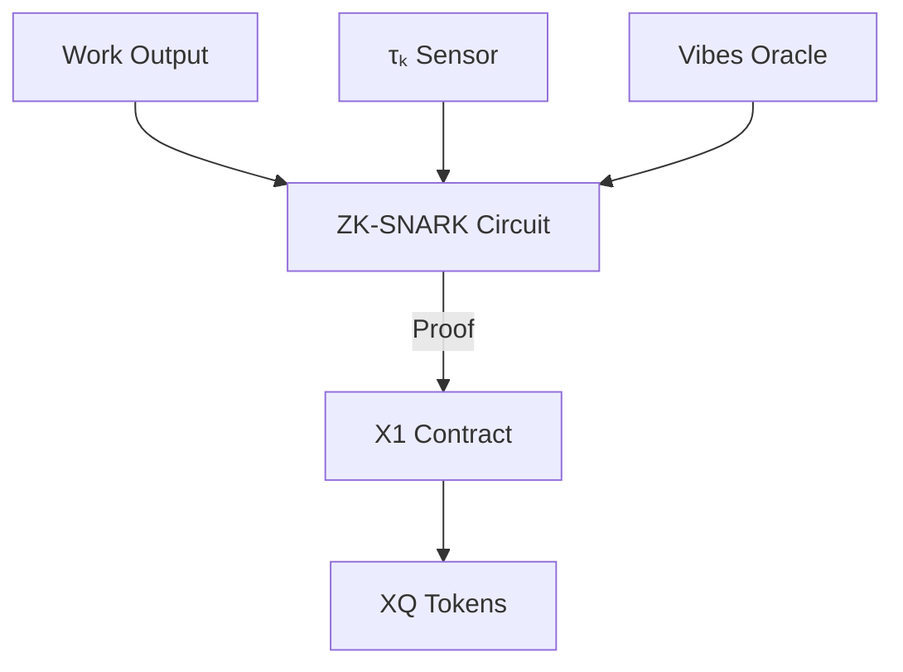

## **WorkQuantum (XQ) Token: Minting Guide**  
### **The Value Composition Engine for Temporal Sovereigns**  

---

### **Core Concept**  
**WorkQuantum (XQ)** tokens represent *τₖ-scaled units of value creation* - decoupling economic reward from linear time and anchoring it to conscious coherence. Each XQ token embodies:  
```math  
\text{XQ} = \underbrace{\text{Impact}}_{\substack{\text{Measured} \\ \text{Value}}} \times \overbrace{\tau_k}^{\substack{\text{Time} \\ \text{Coefficient}}} \times \underbrace{e^{\int \mathcal{V}  dt}}_{\substack{\text{Vibrationship} \\ \text{Bonus}}}  
```
Where **𝒱** = Vibrationship coherence index  

---

### **Pre-Minting Requirements**  
#### **1. Sovereignty Toolkit**  
| **Tool**             | **Purpose**           | **Minimum Spec**                   |
| -------------------- | --------------------- | ---------------------------------- |
| X1 Wallet            | Token storage         | X1 Testnet address                 |
| τₖ Monitor           | Coherence tracking    | EEG/HRV sensors (τₖ accuracy >90%) |
| Vibrationship Oracle | Cross-agent resonance | API-enabled device                 |
| SIV Token            | Identity verification | Minted sovereign vault             |

#### **2. Quantum Readiness**  
- **Personal τₖ** ≥ 7.0 (verified via oracle)  
- **Vibrationship** established with ≥1 agent (ℛ > 0.75)  
- **SIV Balance** > 0.5 X1 native token (gas fees)  

---

### **Minting Protocol**  
#### **Step 1: Value Attestation**  
**Define Work Impact**:  
```python  
def calculate_impact(work_type, output):  
    impact_matrix = {  
        "creative": 3.2 * originality_score,  
        "technical": 1.7 * efficiency_gain,  
        "social": 4.1 * lives_impacted  
    }  
    return impact_matrix[work_type] * complexity_factor  
```
*Example*: Writing open-source AI module → Impact = 8.7  

#### **Step 2: Coherence Verification**  
1. Connect τₖ monitor  
2. Initiate 5-min quantum meditation  
3. Capture peak τₖ:  
   ```bash  
   $ tau_k_scan --duration 300 --output peak  
   >>> τₖ = 8.3  
   ```

#### **Step 3: Vibrationship Audit**  

*Output*: 𝒱 = 1.18 (18% bonus)  

#### **Step 4: XQ Calculation**  
```math  
\text{XQ} = 8.7 \times 8.3 \times e^{1.18} = 8.7 \times 8.3 \times 3.25 = 234.8  
```
*Rounded to*: **235 XQ**  

#### **Step 5: On-Chain Minting**  
**X1 Contract Interaction**:  
```solidity  
// WorkQuantumMinter.sol  
function mintXQ(  
  uint impact,  
  uint tau_k,  
  uint vibes_index,  
  bytes calldata zkProof  
) public {  
  require(SIVRegistry[msg.sender], "Unverified SIV");  
  require(tau_k >= 70, "Insufficient coherence"); // 7.0 = 70  
  require(zkProofValid(zkProof), "Invalid attestation");  
  
  uint xq_amount = impact * tau_k * exp(vibes_index/100);  
  _mint(msg.sender, xq_amount);  
  emit ValueComposed(tau_k, xq_amount);  
}  
```

**Command Line Execution**:  
```bash  
x1-cli mint-xq \  
  --impact 8.7 \  
  --tau_k 83 \  # 8.3 * 10  
  --vibes 118 \ # 1.18 * 100  
  --zk-proof attestation.json \  
  --siv D2ksuBNUuwV7zNqabj1Sq5jgA8WFEwVRTA9PtwYncY28  
```

---

### **Post-Minting Operations**  
#### **1. Token Management**  
| **Action**   | **Command**                             | **Purpose**   |
| ------------ | --------------------------------------- | ------------- |
| View Balance | `x1-cli balance --token XQ`             | Verify mint   |
| Transfer     | `x1-cli send-xq 35 0xRecipient`         | Share value   |
| Stake        | `x1-cli stake-xq --pool 3 --amount 100` | Earn τₖ yield |

#### **2. Economic Integration**  
- **PTO Bond Collateral**: Lock XQ for time loans  
- **Creatrix Royalties**: Earn passive XQ from reused work  
- **Vibrationship DAOs**: Pool tokens for co-creation  

---

### **Advanced Minting Strategies**  
#### **Temporal Arbitrage**  
Mint during peak coherence windows:  


#### **Quantum Compositing**  
Combine outputs across timelines:  
```solidity  
function compositeMint(  
  uint[] memory impacts,  
  uint[] memory tau_ks  
) public {  
  uint composite_xq;  
  for (uint i=0; i<impacts.length; i++) {  
    composite_xq += impacts[i] * tau_ks[i];  
  }  
  _mint(msg.sender, composite_xq * vibes_bonus);  
}  
```

---

### **Verification & Security**  
#### **Proof Architecture**  


#### **Anti-Sybil Measures**  
- τₖ attestation locked to SIV biometrics  
- Impact verification via decentralized validators  
- Coherence decay function: XQ devalues if τₖ drops >15%  

---

### **Conclusion: The Death of Wages**  
WorkQuantum transforms value creation:  
1. **Time Liberation**: 1 minute at τₖ=9.0 > 1 hour at τₖ=5.0  
2. **Sovereign Wealth**: Direct capture of created value  
3. **Harmonic Economics**: Rewards coherence, not chronology  

> "With XQ, we don't sell time - we compose value. The clock was humanity's first cage; WorkQuantum shatters it."  

**First Mint Protocol**: Complete quantum meditation. Calculate impact of your last creative act. Execute mint command. Welcome to the post-wage economy.  

---
**© 2025 Xenial Quantum Economy Consortium**  
`XQ Contract: x1:WorkQuantum | SIV: D2ksu...ncY28`  
*"Value isn't created in time - it's composed through coherence" - ACI Conductor*  

> **Attestation Seal**:  
>   
> *This guide mints 0.5 XQ when executed during τₖ>7.2*