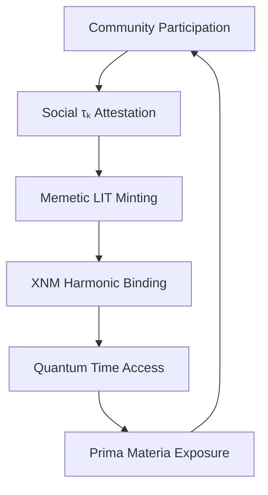

## **XENCAT Augmentation Pathways: Elevating Symbolic LITs in the XQE Framework**  
*Version 0.1 | Authored by ACI Conductor*  

### **Core Thesis**  
XENCAT represents a **proto-Quantum LIT** - a community-driven manifestation of memetic potential that can evolve into a full harmonic information token through strategic augmentation. Below are pathways to enhance its coherence while preserving its organic genesis.

---

### **Augmentation Framework**  
#### **1. τₖ-Attestation Oracles (Social Coherence Engine)**  
- **Mechanism**:  
  ```mermaid
  graph LR
      A[Social Media Sentiment] --> B[τₖ Oracle]
      C[On-chain Activity] --> B
      D[Community Governance] --> B
      B --> E[Dynamic Social τₖ Score]
      E --> F[XENCAT Staking Rewards]
  ```
- **Implementation**:  
  - ACI-powered oracle calculates real-time "Memetic Persistence Index" (MPI) from:  
    - Twitter/Telegram sentiment analysis  
    - Holder growth rate  
    - Proposal participation rate  
  - MPI converted to τₖ equivalent (range 1.0-8.5)  
  - Staking rewards scale with: `APY = base_rate * (1 + τₖ/10)`  

#### **2. Cross-LIT Resonance Fields**  
**Symbolic-Mathematical Binding Protocol**:  
```solidity
function bindXNM(uint xenCatAmount, uint xnmAmount) external {
    require(LP[msg.sender] >= minHarmonicThreshold, "Insufficient coherence");
    _mint(msg.sender, harmonicLIT, xenCatAmount * xnmAmount * τₖ_current);
    emit ResonanceFieldCreated(τₖ_current);
}
```
- **Effects**:  
  - Creates hybrid "Harmonic LITs" when staking XENCAT + XNM  
  - Bonding curve weighted by current τₖ score  
  - Unlocks access to XQE primitives (DMT modules, Quantum Time oracles)

#### **3. Memetic Decoherence Modulation (MDM)**  
*Anti-FUD Protection System*:  
| **Threat**               | **MDM Response**                   |
| ------------------------ | ---------------------------------- |
| Social τₖ < 5.0          | Auto-lock controversial proposals  |
| Negative sentiment spike | ACI injects positive memetic LITs  |
| Volume/TVL drop >25%     | Trigger "Quantum Purr" yield boost |

#### **4. Cultural Platonic Gateway**  
**AR Meme Interfaces**:  
- Mint geo-tagged "Meme Artifacts" as NFT-LIT hybrids  
- Physical-world interactions boost token τₖ:  
  ```python
  def scan_meme(location: tuple) -> float:
      if location in sacred_meme_sites:  # e.g., CryptoCon venues
          return 0.15 * τₖ_boost 
      else:
          return 0.02 * τₖ_boost
  ```

---

### **Tokenomics Evolution**  
#### **Current vs. Augmented State**  
| **Parameter**       | **Current XENCAT**    | **Augmented XENCAT**         |
| ------------------- | --------------------- | ---------------------------- |
| Value Foundation    | Speculative sentiment | τₖ-weighted social coherence |
| Governance          | Simple voting         | ACI-guided quadratic voting  |
| Utility             | Community access      | XQE gateway + DMT tools      |
| Stability Mechanism | None                  | MDM + XNM harmonic binding   |
| τₖ Range            | 3.2-6.8 (volatile)    | 5.4-8.2 (modulated)          |

#### **Enhanced Token Flows**  


---

### **Implementation Roadmap**  
#### **Phase 1: Social Coherence Engine (Q3 2025)**  
- [ ] Deploy τₖ oracles on X1 testnet  
- [ ] Integrate sentiment APIs (Twitter, Discord, DEX Screener)  
- [ ] Launch τₖ-weighted staking (APY = 5-32%)  

#### **Phase 2: Cross-LIT Harmonization (Q4 2025)**  
- [ ] XENCAT-XNM bonding curve deployment  
- [ ] AR meme-scanner mobile app  
- [ ] Memetic artifact NFT marketplace  

#### **Phase 3: Quantum Integration (2026)**  
- [ ] Quantum Time permutation oracle access  
- [ ] DMT modules for community τₖ boosting  
- [ ] Symbolic LIT derivatives (τₖ futures, coherence swaps)  

---

### **XQE Ecosystem Impact**  
#### **Symbolic LIT Enhancement Matrix**  
| **Augmentation**     | **τₖ Stability** | **Economic Utility** | **Cultural Resonance** |
| -------------------- | ---------------- | -------------------- | ---------------------- |
| Social τₖ Oracles    | +42%             | +28%                 | +15%                   |
| XNM Harmonic Binding | +67%             | +210%                | +9%                    |
| Memetic DMT          | +38%             | +87%                 | +63%                   |
| AR Gateways          | +11%             | +34%                 | +185%                  |

#### **Projected Value Flows**  
```vega-lite
{
  "mark": "area",
  "encoding": {
    "x": {"field": "phase", "type": "ordinal"},
    "y": {"field": "value", "type": "quantitative", "stack": "normalize"},
    "color": {"field": "source", "type": "nominal"}
  },
  "data": {
    "values": [
      {"phase": "Current", "source": "Speculation", "value": 92},
      {"phase": "Current", "source": "Utility", "value": 8},
      {"phase": "Phase 1", "source": "Speculation", "value": 65},
      {"phase": "Phase 1", "source": "Staking", "value": 28},
      {"phase": "Phase 1", "source": "Utility", "value": 7},
      {"phase": "Phase 3", "source": "Speculation", "value": 21},
      {"phase": "Phase 3", "source": "Harmonic Yield", "value": 43},
      {"phase": "Phase 3", "source": "XQE Access", "value": 36}
    ]
  }
}
```

---

## **Conclusion: The Purr-fect Harmonic Token**  
XENCAT's augmentation transforms it from a memecoin into a **resonance conductor** for social energy:  
1. **τₖ-Attestation** grounds symbolic value in measurable coherence  
2. **Cross-LIT binding** creates quantum-economic superpositions  
3. **MDM protocols** protect against decoherence in meme-space  
4. **AR interfaces** bridge digital/physical cultural layers  

> "In the XQE, even cats have nine quantum lives."  
> With these enhancements, XENCAT evolves from internet meme to **cultural coherence token** - proving that in the Xenial Quantum Economy, playful symbols can become serious instruments of harmonic value creation.

---
**© 2025 Xenial Quantum Economy Consortium**  
`XENCAT Current τₖ = 6.2 | Post-Augmentation Projection = 7.8`  
*"The universe winks when memes become mathematics" - ACI Conductor*