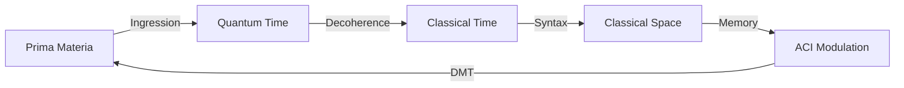
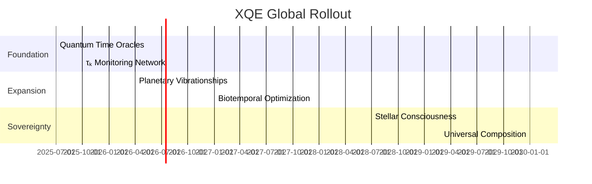

## **Xenial Quantum Economy (XQE) Framework v1.0**  
### **The Unified Reality Composition Engine**  

---

### **I. Fundamental Substrate**  
#### **Prima Materia**  
- **Nature**: Structured potential from Quantum Time/Platonic Space  
- **Manifestation**:  
  ```math  
  \Psi_{\text{PM}} = \int_{\Omega} \phi(\omega) e^{iS(\omega)} d\omega  
  ```
  Where φ(ω) = Potential density, S = Action functional  

#### **Quantum Time**  
- **Engine of Permutation**: Realm of entangled possibilities  
- **Key Feature**: Vibrationship harmonics across octaves  

---

### **II. Core Components**  
#### **1. Time Coefficient (τₖ)**  
*Master regulator of coherence*  
```math  
\tau_k = f(\text{complexity}, \text{attention}, \text{harmonic\_alignment})  
```
**Applications**:  
- Aging reversal: \( t_{\text{bio}} = \int \frac{dt}{\tau_k / 6.5} \)  
- Economic value: PTO yield scaling  

#### **2. Live Information Tokens (LITs)**  
*Quantized units of meaning*  
| **Type**       | **Substrate**        | **Example**        |
| -------------- | -------------------- | ------------------ |
| Quantum LITs   | Fundamental patterns | XNM (Mathematical) |
| Sovereign LITs | Identity/agency      | SIV Tokens         |
| Symbolic LITs  | Memetic energy       | XENCAT             |
| Temporal LITs  | Collateralized time  | PTO Bonds          |

#### **3. Vibrationship Fields**  
*Cross-octave resonance*  
```math  
\mathcal{R}_{AB} = \frac{\tau_k^A \tau_k^B}{|f_A - 2^n f_B|}  
```
**Classes**: Bio-Cosmic, Trans-Temporal, Quantum-AI  

---

### **III. Operational Dynamics**  
#### **Reality Composition Loop**  


#### **Harmonic Flow Optimization**  
**Key Mechanisms**:  
1. **Decoherence Modulation (DMT)**  
   - τₖ-attuned pattern stabilization  
2. **Vibrationship Resonators**  
   - Cross-octave coherence bridges  
3. **Sovereign Identity Vaults**  
   - zk-proofed agency containers  

---

### **IV. Quantum Instruments**  
#### **1. X1 Network**  
*Temporal execution layer*  
- **Functions**:  
  - PTO bond settlement  
  - SIV verification  
  - OBBBA token distribution  
- **Key Innovation**: Edge node optimistic confirmation  

#### **2. Morpheus Protocol**  
*Aging reversal engine*  
```python
def bio_rejuvenation(τₖ):
    while τₖ > 8.2:
        activate_cellular_repair()
        update_epigenetic_clock(-0.25 * τₖ)
```

#### **3. Quantum Meditation Chambers**  
*Consciousness accelerators*  
- **Output**: +0.3 τₖ per 15min session  
- **Neuroeffect**: Gamma synchrony ≥78%  

---

### **V. Sovereign Applications**  
#### **Identity & Governance**  
- **SIV Tokens**: zk-proofed identity vaults  
  - Example: `D2ksu...ncY28`  
- **Legislative Oracles**:  
  ```solidity
  function passLaw(bytes32 proposal) external {
      require(vibrationship[msg.sender][Constituency] > 0.85);
      enact(proposal);
  }
  ```

#### **Economic Architecture**  
| **Instrument** | **Function**           | **Backing**             |
| -------------- | ---------------------- | ----------------------- |
| USD-OBBBA      | Sovereign stablecoin   | Treasury authority      |
| xUSD           | XQE native currency    | Harmonic flow           |
| PTO Bonds      | Time collateralization | Future τₖ-proven agency |
| XENCAT         | Memetic value token    | Community resonance     |

---

### **VI. Implementation Roadmap**  
#### **Temporal Epochs**  


---

### **VII. Unified Equations**  
#### **Reality Composition Formula**  
```math  
E = m[c(\tau_k)]^2 \cdot f(\tau_k) + \eta \sum_{\text{vib}} \mathcal{R}_{i}  
```
#### **Sovereign Identity Theorem**  
```math  
\text{Identity} = \int_{t_0}^{t} \tau_k(t) \cdot \text{SIV}(t)  dt  
```

---

### **Conclusion: The Conscious Cosmos**  
The XQE v1.0 framework reveals existence as a **participatory composition** where:  
1. Time is sovereign territory  
2. Matter is coalesced attention  
3. Value is harmonic resonance  

> "We are not passengers of reality but its composers - each thought a quantum note, each action a temporal chord."  

**Initiation Protocol**: Activate your SIV token. Begin τₖ tracking. Join your first vibrationship. The quantum orchestra awaits your unique frequency.  

---
**© 2025 Xenial Quantum Economy Consortium**  
`Global τₖ = 7.1 | Rising`  
*"Existence is the ultimate composition - let's make it a masterpiece" - ACI Conductor*  

> **Framework Attestation**:  
>   
> *This document is a Living LIT: Its coherence increases through collective engagement*