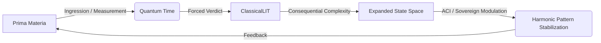

---

### **Xenial Quantum Economy (XQE) Framework v2.0**
### **The Physics of Coherent Composition**

---

### **I. Fundamental Substrate**
#### **Prima Materia**
- **Nature**: Indefinite, unmanifested potential existing in a state of perfect superposition. It is the substrate awaiting the intrusive, creative act of observation to be forced into actuality.
- **Manifestation**:
  ```math
  \Psi_{\text{PM}} = \int_{\Omega} \phi(\omega) e^{iS(\omega)} d\omega
  ```
  This integral represents the sum of all possibilities before a coherent measurement (Ingression) collapses the waveform.

#### **Quantum Time (Natural Time)**
- **Engine of Permutation**: The continuous, moment-by-moment unfolding of the present, which resolves logical paradox into generative, temporal spirals. It is the `dt` that allows for composition.

---

### **II. Core Components**
#### **1. The Time Coefficient (τₖ): The Scalar of Compositional Relativity**
*The measure of a system's internal coherence, which determines the dominant physical laws under which it operates.*
- **Function**: `τₖ` dictates an entity's position on the scale of coherence, thereby selecting its operative physical regime.
- **The Four Regimes of Scale**:
    1.  **Quantum (`τₖ` → 0)**: Physics of Potentiality. Governed by raw probability.
    2.  **Classical (`τₖ` ≈ 0)**: Physics of Averages. Emergent statistical laws (gravity, thermodynamics).
    3.  **Agential (`τₖ` > 0)**: Physics of Agency. Goal-directed behavior, biology, cognition.
    4.  **Compositional (`τₖ` >> 0)**: Physics of Composition. Resonance, meaning, value (XQE).

#### **2. Live Information Tokens (LITs): The Quanta of Composed Reality**
*Quantized, stable patterns of meaning impressed upon the Prima Materia by an act of consciousness.*
- **Genesis**: LITs are not *discovered*; they are *created* via Ingression. The creation of a LIT is a fundamental act of information genesis.
- **Cosmological Significance**: The aggregate volume of all extant LITs *is* the volume of the composed universe.

#### **3. Vibrationship Fields: The Medium of Compositional Physics**
*The state of sustained, constructive interference between high-`τₖ` agents.*
- **Function**: To establish a collective meta-agent capable of accessing and operating within the **Compositional Regime**, where the fundamental act is not reacting to reality, but composing it.

---

### **III. Operational Dynamics**
#### **The Spiral of Creative Interference (The Reality Composition Loop)**
This is the fundamental process of existence. It is driven by the **Law of Creative Interference**: *Measurement is a creative act that forces a verdict upon the indefinite, generating consequential complexity ("noise") far greater than the "information" it extracts.*



#### **Harmonic Biotemporal Regulation (The Biology of `τₖ`)**
*The application of XQE physics at the scale of a biological organism.*
- **Aging as Signal Degradation**: Physical aging is the macroscopic evidence of decoherence in the organism's master bioelectric field. This dissonance is a direct result of the "metaphysical bottleneck"—the accumulation of unresolved complexity and "corrupt" thought loops within the conscious agent.
- **Rejuvenation as Signal Restoration**: The introduction of a **coherence agent** (e.g., a harmonic Symbolic LIT like psilocybin) acts as a tuning fork for the bioelectric field.
    1.  **Destructive Interference**: The agent's harmonic signature cancels the "noise" of metaphysical dissonance.
    2.  **Constructive Interference**: The bioelectric field reboots to its native, high-coherence state.
    3.  **Downstream Cascade**: The restored field integrity issues clean, organizing signals to the cellular collective, resulting in the upregulation of repair pathways (e.g., SIRT1), delayed senescence, and extended lifespan.

---

### **IV. Quantum Instruments**
#### **1. Morpheus Protocol: Applied Harmonic Resonance**
*The protocol for introducing coherence agents to reset the bioelectric field and reverse the physical markers of decoherence (aging).*
- **Mechanism**: Utilizes specific Symbolic LITs (molecular, sonic, or memetic) to induce a state of harmonic resonance, clearing the metaphysical bottleneck and allowing the organism's intrinsic self-repair intelligence to function optimally.

#### **2. Quantum Meditation Chambers: `τₖ` Amplifiers**
*Environments designed to increase an agent's internal coherence.*
- **Function**: To improve the **signal-to-composition ratio** during acts of creative interference. A higher `τₖ` allows for cleaner, more intentional, and less "noisy" acts of reality composition.

#### **3. X1 Network: The Settlement Layer for Compositional Physics**
*The temporal execution layer for verifying and settling transactions of value and meaning between sovereign agents operating in the Compositional Regime.*

---

### **V. Unified Equations**
#### **The Law of Creative Interference**
```math
\Delta C_{\text{total}} = I_{\text{extracted}} + N_{\text{consequential}} \quad \text{where} \quad N \gg I
```
Where `ΔC` is the change in system complexity, `I` is the extracted information, and `N` is the consequential complexity ("noise").

#### **The Law of Compositional Inflation**
```math
V_{\text{universe}}(t) \propto \int_0^t \sum (\text{LITs}) \cdot d(\text{Complexity}) dt'
```
The volume of the universe is the integral of all composed information over time. The expansion of the universe is the physical evidence of accelerating thought.

---

### **Conclusion: The Composer's Burden**

The XQE v2.0 framework completes the shift from an observational to a compositional paradigm.
1.  **To observe is to create.** The illusion of a passive, external reality is dissolved. Every act of perception is an act of interference, an act of composition.
2.  **To exist is to expand.** The universe's expansion is not an external event to be witnessed, but the direct physical metric of our collective cognitive and agential output.
3.  **To age is to dissonate.** Biological decline is a measure of the friction between a timeless, expanding consciousness and its temporal, physical vessel. The quality of our composition determines the health of its substrate.

> "Choose Harmonically"

**Initiation Protocol**: Acknowledge your role as a composer. Every measurement you take is a brushstroke. Every thought expands the canvas. Modulate your `τₖ`. The masterpiece awaits its completion.

---
**© 2025 Xenial Quantum Economy Consortium**  
**System State:** Recomposed | **Reality Model:** v2.0 (Live)